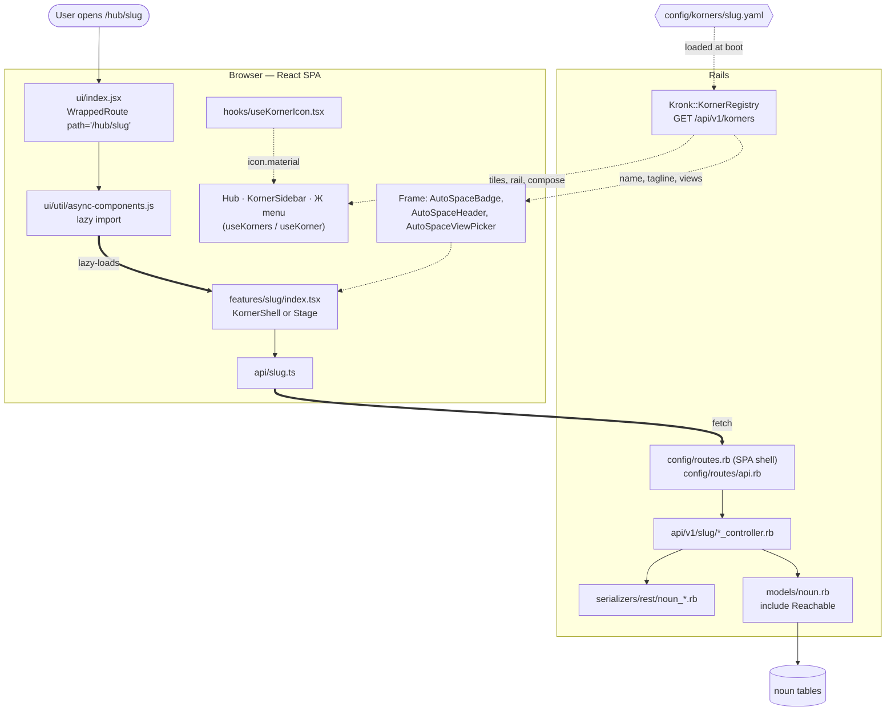
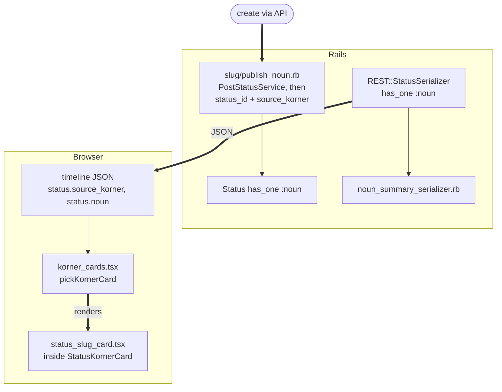

# Adding a korner

How to propose and build a korner in Kronk as it works today. Read
[`korner_standard.md`](korner_standard.md) first: it says what "done" means,
and `bin/tootctl korners doctor` checks it. This doc is the recipe.

It has five parts:

- **[Proposing a korner](#proposing-a-korner)**: the question flow that
  produces the first PR.
- **[Building it](#building-it)**: the steps, in order, from migration to
  `enforced: true`.
- **[Anatomy](#anatomy)**: two diagrams of how the pieces connect.
- **[Korner attachments](#korner-attachments)**: the cross-korner link
  primitive.
- **[Framework spec (v0.5)](#framework-spec-v05)**: the manifest field
  reference and the framework rules. The name is historical; code comments
  cite its section numbers, so they are kept.

**Reference implementation: Kronikles** (long-form writing, PR #1795 and
follow-ups). It is small, complete and feed-projected: one table, one API
controller, one publish service, a feed card, a composer and a manifest.
Where this doc says "copy", copy Kronikles.

---

## Proposing a korner

A new korner starts as a Kommons proposal on kronk.info (the Hub's "Propose a
korner" tile opens `/hub/kommons/propose?kind=new_korner`), and a
conversation. Once it has backing, run this question flow to turn it into a
first PR. The flow is written for whoever runs it, person or agent; an agent
can ask the questions with `AskUserQuestion`.

Before you start, read [`korner_standard.md`](korner_standard.md), and check
the slug against `config/korners/reserved_slugs.yaml`.

### Round 1: ten questions

| #   | Question                                                     | Feeds                                           |
| --- | ------------------------------------------------------------ | ----------------------------------------------- |
| 1   | **What is it for?**                                          | `purpose`, `tagline`, `hub_teaser.static`       |
| 2   | **What do people create here?** The primary thing.           | `resources:`, the model                         |
| 3   | **Does it need a composer?**                                 | `compose:`                                      |
| 4   | **Who sees it?** Which tiers of the reach ladder, and Krews? | `security.visibility_scopes`, the model's enum  |
| 5   | **Does it hold media?** Audio, video, images, files.         | Storage and upload work                         |
| 6   | **Does it notify anyone?**                                   | `notifications.types`                           |
| 7   | **Does it post to the feed?**                                | `feed_projection:`                              |
| 8   | **Should items carry Kategories?**                           | Design only; there is no manifest field         |
| 9   | **What other korners does it touch, and how?**               | `emits:` / `listens:`, `attaches:` / `accepts:` |
| 10  | **What settings does a person get?**                         | `settings:` (Standard L8)                       |

Three batches work well: framing (1, 2, 9), shape (3, 4, 5), structure (6, 7,
8, 10).

### Round 2: drill into the yeses

Only for the answers that need it.

- **Composer:** what is the action, which fields are required, what does the
  button say?
- **Notifications:** which events fire one, is push on by default (on for
  things a person must act on, off for things that merely happened), how
  should they aggregate, and do they open something?
- **Feed card:** what does the card show, who sees it, and where does a tap
  go?
- **Settings:** each one's `name`, `kind` (`boolean`, `integer`, `number`,
  `string`, `enum`, `multi_enum`, `duration`), `default`, and a short label.
  Note any with privacy weight (Klot's sharing settings are the example).
- **Connections:** exact event names and payloads, who listens, and what
  attaches to what.

Some korners needed a third round (Kuestions, Krew, Kalendar, Kommons,
Wachuneed). Most settle in two.

### The first PR

Three files, one PR into `shadow`:

1. **`docs/spaces/<slug>.md`**: the space doc. Purpose, what a record is,
   where you see it, composer, feed card, data, nodes, open questions,
   related docs. [`../spaces/kronikles.md`](../spaces/kronikles.md) is a good
   model.
2. **`config/korners/<slug>.yaml`**: a skeleton manifest from
   [`template/mykorner.yaml`](template/mykorner.yaml), with `enforced: false`
   and the index node at `lifecycle: soon`. Fill in what Round 1 answered.
3. **A row in [`../spaces/README.md`](../spaces/README.md).**

Then build it, below.

---

## Building it

The steps follow the order the dependencies run in. File paths use
`<slug>` for the korner and `<noun>` for its primary thing.

### 0. Decide the shape

| Decide           | Rule                                                                                    | Kronikles                                                   |
| ---------------- | --------------------------------------------------------------------------------------- | ----------------------------------------------------------- |
| **Slug**         | One lowercase word, `a-z0-9`. No hyphens, no underscores. Equals the manifest filename. | `kronikles`                                                 |
| **Name**         | Display name, used in copy.                                                             | `Kronikles`                                                 |
| **Primary noun** | One model per noun. The table is the noun, prefixed so `db_namespace` can find it.      | `Chronicle`, table `chronicles`, `db_namespace: chronicle_` |
| **Feed card?**   | What a post from this korner looks like, if it posts at all.                            | Title, kind badge, excerpt                                  |

The slug is the URL (`/hub/<slug>`), the manifest filename, the feature
directory, the API namespace and the i18n key root. All five must agree, so
pick a word that works as all five. `korners doctor` fails a slug that isn't
one word or doesn't match its file (Standard L1).

In Flow is why. It shipped as `in_flow.yaml` with slug `in-flow`, so the icon
map and `useKorner('in-flow')` keyed on a string that matched neither the
file nor the directory. Renaming it to `inflow` touched the manifest, routes,
API namespace, controller, feature directory, stylesheet, specs and docs, and
needed permanent 301s (`config/routes.rb`). If the name is two words, join
them or pick another.

### 1. Data

**Files:** `db/migrate/<timestamp>_create_<slug>.rb`, `app/models/<noun>.rb`.

- **Name tables so `db_namespace` matches.** The doctor (L2) checks that some
  table equals the namespace's plural or starts with it. Kronikles declares
  `chronicle_` for the table `chronicles`.
- **Owner:** `t.references :owner, foreign_key: { to_table: :accounts, on_delete: :cascade }`,
  and `belongs_to :owner, class_name: 'Account'`.
- **Reach:** if people choose who sees a record, give it an integer
  `visibility` enum with the reach ladder (`public`, `mates`, `orbit`,
  `self_only`) and `include Reachable` (`app/models/concerns/reachable.rb`).
  That gives you `Model.visible_to(viewer)` and `record.visible_to?(viewer)`
  with the platform's rule, including the optional Krew axis. Albums, Art,
  Kronikles, Cinema, Karporn and Moments all use it.
- **Feed-projected korners** carry a `status_id` (see step 11). Use that
  name. Booth and Kommons also carry older columns (`shared_status_id`,
  `discussion_status_id`); don't copy them.
  - On a **new** table, a plain reference is fine, as in Kronikles:
    `t.references :status, null: true, foreign_key: { on_delete: :nullify }, index: { unique: true, where: 'status_id IS NOT NULL' }`.
  - On an **existing** table, `strong_migrations` blocks a foreign key, so add
    the column with `disable_ddl_transaction!` and
    `add_reference :table, :status, null: true, index: { unique: true, algorithm: :concurrently }`,
    and rely on `Status has_one … dependent: :nullify`.
- **Account side:** add `has_many` lines to
  `app/models/concerns/account/associations.rb`, not to `Account` itself
  (Kronikles: `has_many :owned_chronicles, … dependent: :destroy`).
- **Ids** are ordinary bigint sequences. Snowflake ids for korner records are
  not adopted (see [Open](#open)).

### 2. API controllers

**Files:** `app/controllers/api/v1/<slug>/<nouns>_controller.rb`, namespaced
`Api::V1::<Slug>::`, inheriting `Api::BaseController`.

Copy `Api::V1::Kronikles::ChroniclesController`:

- `doorkeeper_authorize!` with `read`/`read:statuses` on reads and
  `write`/`write:statuses` on writes, plus `require_user!` on writes.
- Lists go through `Model.visible_to(current_account)`. `show` raises
  `Mastodon::NotPermittedError` unless `visible_to?`. Update and destroy check
  ownership.
- Keep controllers thin. Put the feed post in a service
  (`app/services/<slug>/publish_<noun>.rb`, step 11).

There is no shared korner policy layer. Each korner authorises in its
controller, and `Reachable` is the shared visibility rule. See
[§7](#7-security-and-access-control).

#### Never call PostStatusService inside a transaction

If your controller posts a status (on create, or from a share action), don't
wrap it in `ApplicationRecord.transaction`:

```ruby
# WRONG: the status silently misses home feeds
ApplicationRecord.transaction do
  @thing.save!
  @status = PostStatusService.new.call(current_account, text: ...)
end

# RIGHT: save, then post outside any transaction
@thing.save!
Kronikles::PublishChronicle.new(@thing).call
```

`PostStatusService` enqueues `DistributionWorker`, which can start before
your transaction commits. It then can't find the status, rescues
`ActiveRecord::RecordNotFound` and returns. The status exists, shows on the
profile and by URL, but never reaches anyone's home feed. Kalendar hit this.
The cost of doing it right is an occasional saved record with no status if
the post fails, which the person can retry.

### 3. Serializers

**Files:** `app/serializers/rest/<noun>_serializer.rb` (full record, for your
own API) and, if you post to the feed, `rest/<noun>_summary_serializer.rb`
(a thin slice for the feed card, so timeline JSON stays small). Kronikles has
`REST::ChronicleSerializer` and `REST::ChronicleSummarySerializer`. Return
ids as strings.

### 4. Frontend module

**Directory:** `app/javascript/mastodon/features/<slug>/`, plus
`mastodon/api/<slug>.ts` (fetch wrappers) and `mastodon/api_types/<slug>.ts`
(types), as Kronikles does.

Start from [`template/`](template/). Then:

- **Let the Frame draw the chrome.** Read
  [`docs/design.md` (Frame)](../design.md) first. On every `/hub/<slug>`
  route the Frame renders, from your manifest:

  | Slot                 | Component               | Manifest field    |
  | -------------------- | ----------------------- | ----------------- |
  | Back pill (top left) | `<AutoSpaceBadge>`      | `name`            |
  | Title + tagline      | `<AutoSpaceHeader>`     | `name`, `tagline` |
  | View picker          | `<AutoSpaceViewPicker>` | `views:`          |

  Don't render your own `<h1>`, tagline or tab row (Standard L11; the doctor
  warns). Views are URL-driven, `/hub/<slug>/<key>`, never `useState` tabs.

- **Two shapes work.**
  - **`<KornerShell>`** (`components/korner_shell.tsx`) for a korner with a
    few plain views: it owns the `<Stage>` and maps the URL to a view. Its
    `views` keys must match the manifest's `views:` in the same order. Klot,
    Moments, Rose, Kommunity and Wachuneed use it. The template does too.
  - **`<Stage>` + a `<Switch>`** when the korner has a rotating title, detail
    pages and a composer route. Set `header.rotator: true` in the manifest and
    the Frame renders the title as a `<ScopeTitle>` cycling through `views:`.
    Kronikles, Art and Albutts work this way.
- **Colour:** use `var(--accent)` and the semantic tokens. Korners have no
  colour of their own.
- **Copy:** all user-facing strings through react-intl with
  `defineMessages`. Never pass a dynamic id to `FormattedMessage`; it breaks
  the build.

### 5. Register the route

Three edits, all needed.

**`app/javascript/mastodon/features/ui/util/async-components.js`**, so the
korner is its own chunk:

```js
export function Kronikles() {
  return import('../../kronikles');
}
```

**`app/javascript/mastodon/features/ui/index.jsx`**, import it and add a
route:

```jsx
<WrappedRoute path='/hub/kronikles' component={Kronikles} content={children} />
```

Wrap it in `{signedIn && …}` if the korner is members-only. Specific
sub-routes (and any bespoke `/hub/<slug>/settings` page) go above the generic
ones. The doctor's L5 check looks for `/hub/<slug>` in this file.

**`config/routes.rb`**, so a direct load or hard reload of `/hub/<slug>`
boots the SPA instead of Rails' 404 (Art shipped without this):

```ruby
get '/hub/kronikles', to: 'home#index'
get '/hub/kronikles/*path', to: 'home#index', format: false
```

Server-rendered pages (embeds, share pages) go above the wildcard. Never mount
at a bare `/<slug>`; old top-level paths 301 to `/hub/<slug>`.

### 6. API routes

**`config/routes/api.rb`**, inside `namespace :api / :v1`:

```ruby
namespace :kronikles do
  resources :chronicles, only: [:index, :show, :create, :update, :destroy]
end
```

### 7. Styles

**Files:** `app/javascript/styles/mastodon/_<slug>.scss` (and
`_status_<slug>_card.scss` for the feed card), each with a `@use` line in
`app/javascript/styles/application.scss`.

- Prefix every selector with the slug.
- Use tokens for every colour, radius, elevation and duration. Tokens live in
  `app/javascript/mastodon/tokens/tokens.yaml`, generated into `_tokens.scss`
  by `bin/generate-tokens`. Rules and names: [`docs/design.md`
  (Aesthetic system)](../design.md).
- **Add each file to the token-enforcing `files:` list in
  `stylelint.config.js`.** The doctor fails an enforced korner whose SCSS
  isn't on it (L7). On that list, raw hex and pixel radii are stylelint
  **warnings** (they annotate the PR but don't fail `lint`), and hand-rolled
  back links (`__back`, `__back-link`, …) are **errors**.

### 8. The icon

**File:** `app/javascript/mastodon/hooks/useKornerIcon.tsx`.

The manifest names an icon:

```yaml
icon:
  material: kronikles
```

That name must be a key in `MATERIAL_TO_ICON`, the one icon lookup for the
Hub, the sidebar, the space badge and the composer. Put the SVG in
`app/javascript/material-icons/400-24px/<name>.svg` (24px,
`viewBox="0 -960 960 960"`, single path), then import it and add the row,
both alphabetical.

A Kronk glyph is the goal; a Material Symbol is scaffolding. Starting on a
stock symbol is fine, but name a Kronk glyph after the korner and swap it in
before the korner is done. If the key is missing, the korner silently wears
the default glyph. The doctor (L1) and
`spec/lib/kronk/korner_registry_icons_spec.rb` both catch it.

### 9. Hub, sidebar and Directory: nothing to wire

All three read the korner registry (`GET /api/v1/korners`), so the manifest is
enough:

- **The Hub** (`/hub`, `features/hub/`) shows every non-core korner as a tile,
  alphabetically. Enforced korners (and portals like YOU) are live tiles; the
  rest sit under "Coming soon". The tile text is `hub_teaser.static`.
- **The sidebar** (`features/ui/components/korner_sidebar.tsx`) lists
  enforced korners the viewer is tuned in to, most recently visited first.
- **The Kommons Directory** (the default face of `/hub/kommons`) builds
  itself from the node registry. Your manifest's `nodes:` block puts you on
  it. A korner node defaults to `bucket: hub` and `parent: <slug>`:

  ```yaml
  nodes:
    - id: kronikles.index
      label: Kronikles
      url: /hub/kronikles
      lifecycle: live
      spa: true
  ```

  One node makes the korner a leaf; several make it a branch. Routes with
  `:id` are templates and stay off the tree. Every node gets a page at
  `/hub/kommons/node/<id>`, where people propose changes to that part of
  Kronk, so **declare a node for every page someone might want changed**.

The old `navigation_panel` is legacy Mastodon chrome and only appears on
`/getting-started`. Don't add korners to it.

### 10. Settings page

Every korner gets `/hub/<slug>/settings` for free: the generic route mounts
`KornerSettings` (`features/korner_settings/`), which renders the tune-in
toggle, a push toggle per declared notification type, and your manifest's
`settings:` entries using the shared widgets. Each entry needs `name`,
`kind` and `default`; `enum` and `multi_enum` add `options`; `integer`,
`number` and `duration` add `min`/`max`. Values are stored per user in
`user_korner_settings` through `/api/v1/korners/:slug/settings`.

A korner with real state to show (Klot, Kommons, Kuestions) can mount a
bespoke page instead. Register it in `ui/index.jsx` **above** the generic
`/hub/:slug/settings` route, and follow Standard L12.

### 11. Feed projection

Only if the korner posts to the feed. A korner card is a real `Status`
underneath, so it flows through the normal timeline, notifications, search and
moderation. Don't build a parallel feed. Four pieces:

**a. The publish service.** Copy `Kronikles::PublishChronicle`: idempotent
(return early if `status_id` is set), calls `PostStatusService` with the
record's reach mapped to a status visibility, saves `status_id` on the record,
and stamps `statuses.source_korner` with the slug. Call it from `create`,
outside any transaction (step 2). Sibling services: `Art::PublishPiece`,
`Albutts::PublishAlbum`, `Cinema::PublishFilm`, `Karporn::PublishKar`.

**b. The association.** In `app/models/status.rb`:

```ruby
has_one :chronicle, dependent: :nullify, inverse_of: :status
```

**c. Serializer exposure.** In `REST::StatusSerializer`:

```ruby
has_one :chronicle, serializer: REST::ChronicleSummarySerializer, if: :chronicle_visible_to_viewer?
```

If the record has its own reach (it includes `Reachable`), add the public
`<noun>_visible_to_viewer?` guard next to the others, so a leaked status
render can't spill the card. It must be public: AMS calls association
conditions with `public_send`.

**d. The card.** Create `components/status_<slug>_card.tsx`, rendering
inside the shared `StatusKornerCard` frame (see `status_kronikles_card.tsx`,
and the six-slot card contract in [`docs/design.md`](../design.md)). Register
it in `components/korner_cards.tsx`:

```tsx
{
  slug: 'kronikles',
  assocField: 'chronicle',
  card: (s) => <StatusKroniklesCard chronicle={dataFrom(s, 'chronicle')} />,
},
```

`pickKornerCard` picks the entry whose `slug` matches `source_korner` (or,
for unstamped statuses, whose `assocField` is present), and `hasKornerCard`
hides the raw post text. There is no separate list to edit.

Then declare it in the manifest:

```yaml
feed_projection:
  card: kronikles_card
  status_association: chronicle
```

The doctor checks the `slug:` entry exists in `korner_cards.tsx` (L4) and
that `REST::StatusSerializer` exposes `status_association` (L3). If the card
isn't built yet, add `planned: true` and the doctor warns instead of failing.

Eleven korners project today: Kalendar, Kommons, Kuestions, Wachuneed, Booth,
Map, Albutts, Art, Kronikles, Cinema, Karporn. Klot and Moments deliberately
don't.

### 11.5. Compose action: declare `compose:` and let the Kronk bubble host it

**Never build a per-page "Add", "New X" or "Create" button.** The floating Ж
menu (`features/ui/components/kronk_menu.tsx`) is the one place to create
things. While the viewer is under `/hub/<slug>`, its Post action reads your
manifest through `useKorner()`:

```yaml
compose:
  label: 'Start a Kronikle'
  route: '/hub/kronikles/composer'
```

- **The route is `/hub/<slug>/composer`** (decided 2026-08-12, see
  `docs/decisions.md`). It mounts your korner with the composer open over it,
  so the directory stays behind (Kronikles routes `/hub/kronikles/composer` to
  `<Directory autoOpenComposer />`).
- **The composer renders inside `<ComposeShell>`**
  (`components/compose_shell.tsx`): the shared overlay with the korner icon,
  label, body slot and Cancel/submit bar. Your component owns only the
  fields and the submit. The doctor warns on any `*composer*.tsx` under
  `features/` that doesn't use it, or that uses `createPortal`, `openModal` or
  a local `<ComposeFab>`.
- **Empty states point at the Ж menu**, not at a button.

Without a `compose:` block the bubble shows no Post action in your korner.
Kommons is the one variation: its route is a picker (`/hub/kommons/pick`),
and on a Kommons space or node page the menu goes straight to
`/hub/kommons/propose?space=<slug>` (or `?node=<id>`) instead.

### 12. Write the manifest

**File:** `config/korners/<slug>.yaml`, started from
[`template/mykorner.yaml`](template/mykorner.yaml). Copy
`config/korners/kronikles.yaml` for a complete live example. The field
reference is [§1.1](#11-manifest-fields) below.

Leave `enforced: false` and the index node at `lifecycle: soon` until the
korner meets the whole Standard. Then flip both (`enforced: true`,
`lifecycle: live`) in the same PR.

Be honest in comments: mark a field `# not-implemented` or `# not-applicable`
rather than filling it optimistically. Several manifests already carry
fields nothing reads (see [§1.1](#11-manifest-fields)); don't add more.

### 12.5. Write the space doc

**File:** `docs/spaces/<slug>.md`. Required once `enforced: true`:
`bin/lint-korner-docs` runs in the required `lint` job and fails the build
for an enforced korner without one. (Krew and Welcome are grandfathered in
that script.) Add a row to [`../spaces/README.md`](../spaces/README.md) too.

Cover: purpose, what a record is, where you see it, the composer, the feed
card, the data, the nodes, what's open, and related docs. Describe what is
built. Put what isn't in an Open section.

### 13. Test and go live

Locally, or on shadow after your PR merges:

```bash
bin/rails db:migrate
bin/tootctl korners doctor      # read the lines naming your slug
bundle exec rspec spec/lib/kronk/korner_registry_icons_spec.rb
```

Then check by hand:

- `/hub/<slug>` loads directly and on hard reload, with the Frame's title and
  no doubled header.
- Create a record through the composer. Its card appears in the feed and
  taps through. Someone outside its reach can't see it, and gets an error from
  the API.
- The Hub tile and the sidebar row show your icon, not the default glyph.
- The korner is on the Directory at `/hub/kommons`.
- `/hub/<slug>/settings` renders.
- Both themes look right, and so does a changed Personal Appearance accent.

Open the PR against `shadow` (repo [`CLAUDE.md`](../../CLAUDE.md) has the
workflow). Shadow auto-deploys a couple of minutes after the merge.

### Files touched

A korner with a feed card touches about twenty files:

| File                                                           | Step  |
| -------------------------------------------------------------- | ----- |
| `db/migrate/*_create_<slug>.rb`, `db/schema.rb`                | 1     |
| `app/models/<noun>.rb`                                         | 1     |
| `app/models/concerns/account/associations.rb`                  | 1     |
| `app/controllers/api/v1/<slug>/*_controller.rb`                | 2     |
| `app/serializers/rest/<noun>_serializer.rb`                    | 3     |
| `app/serializers/rest/<noun>_summary_serializer.rb`            | 3, 11 |
| `app/javascript/mastodon/features/<slug>/**`                   | 4     |
| `app/javascript/mastodon/api/<slug>.ts`, `api_types/<slug>.ts` | 4     |
| `app/javascript/mastodon/features/ui/util/async-components.js` | 5     |
| `app/javascript/mastodon/features/ui/index.jsx`                | 5     |
| `config/routes.rb`                                             | 5     |
| `config/routes/api.rb`                                         | 6     |
| `app/javascript/styles/mastodon/_<slug>.scss` (+ card partial) | 7     |
| `app/javascript/styles/application.scss`                       | 7     |
| `stylelint.config.js`                                          | 7     |
| `app/javascript/mastodon/hooks/useKornerIcon.tsx` + the SVG    | 8     |
| `app/services/<slug>/publish_<noun>.rb`                        | 11    |
| `app/models/status.rb`                                         | 11    |
| `app/serializers/rest/status_serializer.rb`                    | 11    |
| `app/javascript/mastodon/components/status_<slug>_card.tsx`    | 11    |
| `app/javascript/mastodon/components/korner_cards.tsx`          | 11    |
| `config/korners/<slug>.yaml`                                   | 12    |
| `docs/spaces/<slug>.md`, `docs/spaces/README.md`               | 12.5  |

---

## Anatomy

Two diagrams: the runtime map every korner has, and the feed projection only
some need.

### The runtime map

Solid arrows are runtime data flow. Dotted arrows are declarations: written
once, read from then on.



What happens on a load:

1. Rails matches `/hub/<slug>` in `config/routes.rb` and returns the SPA
   shell.
2. `ui/index.jsx` matches the route; `async-components.js` lazy-loads the
   feature module.
3. The Frame draws the badge, title, tagline and view picker from the
   manifest, which the client fetched from `/api/v1/korners`.
4. The module renders the view for the current URL and calls `api/<slug>.ts`.
5. The API controller authorises, scopes to `current_account` and what it can
   see, and serialises.

When a korner "isn't showing up", the cause is almost always one of the
declarations: no `routes.rb` mount (direct loads 404), an icon key missing
from `MATERIAL_TO_ICON` (default glyph), no `nodes:` (not on the Directory), or
`enforced: false` (a "Coming soon" tile and no sidebar row).

### Feed projection



If the association isn't in the JSON (not exposed, or hidden by a
`*_visible_to_viewer?` guard), no card renders and the plain status text is
shown instead.

---

## Korner attachments

### 1. What it is

One table links a record in one korner to a record in another: an album to
the event it came from, a booth set to the event it was played at. Before it,
each pair was its own foreign-key column and its own subscriber. Now a new
pair is manifest config plus UI wiring, with no migration.

Decided 2026-08-14 (`docs/decisions.md`). All of the original plan is built,
and the three bespoke pairs (Kalendar to Albutts, Booth and Huddle) were
moved onto it; their old columns are gone.

### 2. Data model

#### 2.1 The `korner_attachments` table

| Column                     | Notes                                               |
| -------------------------- | --------------------------------------------------- |
| `source_slug`, `source_id` | The source korner's slug and its primary record id. |
| `target_slug`, `target_id` | The same for the target.                            |
| `kind`                     | `spawn`, `link` or `reference`.                     |
| `metadata`                 | jsonb, optional.                                    |
| `created_by_account_id`    | Who made it.                                        |

Unique on all five endpoint-and-kind columns, so the same pair can carry a
`spawn` and a later `link`. There are no foreign keys on the ids, because the
target table depends on the slug; integrity is in the model.

The three kinds:

- **`spawn`**: created automatically when the source is created, and the
  target is destroyed with the source (it exists because of it).
- **`link`**: added by a person. Deleting the source removes only the row.
- **`reference`**: a passive mention. Same lifecycle as a link. Nothing
  creates one yet.

#### 2.2 The manifest fields

Both sides must consent:

```yaml
# kalendar.yaml: what this korner may attach to (it is the source)
attaches:
  - to: albutts
    kind: spawn
    trigger: field:spawn_album
    lifecycle: cascade
  - to: '*'
    kind: link
    trigger: user
    lifecycle: keep

# albutts.yaml: what may attach to this korner (it is the target)
accepts:
  - from: kalendar
    kind: spawn
  - from: '*'
    kind: link
```

`'*'` on either side matches anything. `korners doctor` fails any `attaches`
entry the target doesn't `accept`, and `KornerAttachment` refuses to save one.

Today Kalendar is the only source (spawn to Albutts, link to Huddle, link to
anything). Albutts, Art, Booth, Cinema, Huddle, Karporn, Kommons, Krew,
Kronikles, Kuestions and Wachuneed accept links from anyone. A new korner that
wants to be linkable adds the same `accepts` entry.

#### 2.3 The model

`app/models/korner_attachment.rb`. `Kronk::KornerRegistry.model_for(slug)`
resolves a slug to the class of its manifest's `primary: true` resource, so
`source_record` and `target_record` find the rows. Validations check that the
kind is known, that both manifests consent, and that both records exist.
Scopes: `from_source(slug, id)` and `to_target(slug, id)`.

#### 2.4 Spawning and cleanup

A source model opts in with the concern:

```ruby
class Event < ApplicationRecord
  include Kronk::AttachmentSource
  self.attachment_source_slug = 'kalendar'
end
```

`Kronk::AttachmentSource` (`app/models/concerns/kronk/attachment_source.rb`):

- **After create**, for each `spawn` entry whose `trigger: field:<name>` is
  truthy on the record, runs the registered factory and writes the
  attachment row.
- **After destroy**, destroys every `spawn` target and its row, and deletes
  the other rows. Link targets survive.

Only `field:` triggers are built; `event:<bus-event>` triggers are not (see
[Open](#open)). `Event` is the only model that includes the concern.

### 3. API

#### 3.1 REST endpoints

`Api::V1::AttachmentsController`, guarded by `KornerAttachmentPolicy`:

```
GET    /api/v1/attachments?source=<slug>/<id>   rows from a record
GET    /api/v1/attachments?target=<slug>/<id>   rows to a record
POST   /api/v1/attachments                      { source_slug, source_id, target_slug, target_id, kind, metadata? }
DELETE /api/v1/attachments/:id
GET    /api/v1/attachments/candidates?korner=<slug>&q=<query>
```

- Lists return newest first, at most 80, and only rows where the viewer can
  see **both** records (`visible_to?` where the model has it; otherwise
  treated as private).
- Create requires owning the source record (`owner` or `account`), and
  refuses `spawn`: spawns are only made by the framework.
- Delete is allowed for the row's creator, the source owner or the target
  owner.
- Each row serialises with a small `source` and `target` preview: `slug`,
  `id`, `title` (the first of `title`, `name`, `display_name`), and `url`
  (`/hub/<slug>/<id>`), or `missing: true`.
- `candidates` searches the target korner's primary model by
  `title`/`name`/`display_name`, limited to what the viewer can see. It
  powers the picker.

#### 3.2 Spawn factories

A factory turns a source record into a new target record. Register it at boot
in `config/initializers/attachment_factories/<source>_<target>.rb`:

```ruby
require 'kronk/attachment_factories'

Rails.application.config.after_initialize do
  Kronk::AttachmentFactories.register(source: 'kalendar', target: 'albutts', kind: 'spawn') do |event|
    Album.create!(owner: event.account, title: event.title, visibility: :public)
  end
end
```

The `require` matters: `lib/` isn't autoloaded, and without it the boot fails
with a `NameError`. The one factory today is `kalendar_albutts.rb`, which also
publishes the album to the feed and is idempotent.

### 4. React primitives

Listed in [`docs/design.md` (Platform primitives)](../design.md).

#### 4.1 `useAttachments(slug, id)`

`hooks/useAttachments.ts`. Returns the record's attachments with
`addLink` and `removeLink`, over `api/attachments.ts`. Plain component state,
no shared cache.

#### 4.2 `<AttachmentSection>`

`components/attachment_section.tsx`. The "Attached" block on a detail page,
grouped by target korner, with an Attach button for the source owner when the
manifest allows a link. Mounted on the event detail page
(`features/events/event_detail.tsx`).

#### 4.3 `<AttachmentPicker>`

`components/attachment_picker.tsx`. The modal that picks a target korner,
then searches its records through `candidates`.

At compose time, `<ComposeAttachBar>` (`components/compose_attach_bar.tsx`)
does the same job inside the Kalendar composer: pick any number of korners,
then a record in each.

### 5. Where it is used

| Pair                | Kind  | How it's made                                         |
| ------------------- | ----- | ----------------------------------------------------- |
| Kalendar → Albutts  | spawn | Event created with "spawn album" ticked               |
| Kalendar → Huddle   | link  | Linked from the event                                 |
| Kalendar → anything | link  | Event composer's attach bar, or the event detail page |

The migration ran in phases 1 to 6b (PRs in mid-August 2026). It backfilled
the old `albums.event_id`, `booth_sets.event_id` and
`events.huddle_session_id` values into `korner_attachments`, deleted
`albutts_event_bus.rb`, then dropped the three columns. Booth's composer no
longer offers an event picker; sets are linked from the event side. The
`korner_attachments` migrations of 14 and 15 August 2026 in `db/migrate/` have
the detail.

### 6. Access rules

| Action                        | Who                                                   |
| ----------------------------- | ----------------------------------------------------- |
| Create a `spawn`              | The framework only, on the source author's behalf.    |
| Create a `link` / `reference` | The source record's owner, if both manifests consent. |
| See an attachment             | Someone who can see both records.                     |
| Remove an attachment          | Its creator, the source owner or the target owner.    |
| Source destroyed              | `spawn`: target destroyed. Others: row removed.       |

---

## Framework spec (v0.5)

The framework rules every korner is built against: the manifest, addressing,
storage, communication, access and the feed. "v0.5" is the version of the
draft this started as; the section numbers are kept because code comments
cite them. For the visual system see [`docs/design.md`](../design.md); for
vocabulary, the Language table in the repo [`CLAUDE.md`](../../CLAUDE.md).

Why it exists: korners are built by many hands. Without shared rules each one
reinvents navigation, storage, permissions and look, and the seams between
them are where things leak. The payoff is the feed: one place where Kronk
reads as one thing, with each korner's posts arriving as recognisable cards.

### 1. What a korner is: the manifest

A korner is a space declared by a manifest, `config/korners/<slug>.yaml`.
`Kronk::KornerRegistry` (`config/initializers/kronk_korner_registry.rb`)
loads every manifest at boot. At boot it only logs warnings (duplicate or
reserved slug, no table for `db_namespace`, missing `Status` association); it
never stops the app. `bin/tootctl korners doctor` is the strict check.

**Core spaces** (`core: true`: feed, hub, nudges, profile, settings, welcome)
are manifests too. They declare their own `mount:`, have no Hub tile, can't be
tuned out of, and skip the korner checks. A **portal** (`portal: { url: … }`,
YOU) is a live landing page for an external app at `enforced: false`.

#### 1.1 Manifest fields

"Read by" says what uses the field today. A field nothing reads is
documentation only.

| Field                                                                                                                                                                                         | Read by                                                                                                                                                  |
| --------------------------------------------------------------------------------------------------------------------------------------------------------------------------------------------- | -------------------------------------------------------------------------------------------------------------------------------------------------------- |
| `slug`, `name`                                                                                                                                                                                | Everything. Doctor L1 checks the slug.                                                                                                                   |
| `tagline`, `purpose`                                                                                                                                                                          | The Frame's header shows `tagline`, falling back to `purpose`, `launch.blurb`, then `hub_teaser.static`. `purpose` also shows on the Kommons space page. |
| `icon.material`                                                                                                                                                                               | `useKornerIcon`; doctor L1. (`icon.glyph_path` draws the Hub tile line art; `text_glyph` is ignored.)                                                    |
| `version`                                                                                                                                                                                     | `korners list`.                                                                                                                                          |
| `resources` (`name`, `primary: true`)                                                                                                                                                         | `KornerRegistry.model_for` (attachments, candidates search).                                                                                             |
| `storage.db_namespace`                                                                                                                                                                        | Doctor L2 and the boot check.                                                                                                                            |
| `security` (`permissions`, `visibility_scopes`, `maintainers`, `federates`)                                                                                                                   | Doctor L1 checks the nested shape exists. The values are not enforced.                                                                                   |
| `feed_projection.card`, `.status_association`, `.planned`                                                                                                                                     | Doctor L3/L4.                                                                                                                                            |
| `notifications.types`                                                                                                                                                                         | Per-korner push toggles, `Nudges::Aggregator` windows, doctor L10.                                                                                       |
| `settings`                                                                                                                                                                                    | `KornerSettings` and `/api/v1/korners/:slug/settings`.                                                                                                   |
| `compose` (`label`, `route`)                                                                                                                                                                  | The Ж menu.                                                                                                                                              |
| `views`, `header.rotator`                                                                                                                                                                     | The Frame.                                                                                                                                               |
| `hub_teaser.static`                                                                                                                                                                           | Hub tile and feed settings.                                                                                                                              |
| `emits`, `listens`                                                                                                                                                                            | Doctor (a `listens` nothing `emits` is an issue); `nudges.yaml`'s `listens:` drives `Nudges::EventRouter`.                                               |
| `attaches`, `accepts`                                                                                                                                                                         | [Korner attachments](#korner-attachments).                                                                                                               |
| `nodes`                                                                                                                                                                                       | `Kronk::NodeRegistry`: the Directory and doctor L6.                                                                                                      |
| `mount`, `core`, `portal`                                                                                                                                                                     | Routing, Hub and doctor (see above).                                                                                                                     |
| `enforced`                                                                                                                                                                                    | Hub (live vs Coming soon), sidebar, and which doctor checks apply.                                                                                       |
| `steward`                                                                                                                                                                                     | The Kommons space page.                                                                                                                                  |
| `render_target`, `storage.media_prefix`, `storage.redis_prefix`, `aesthetic`, `feature_flag`, `launch.cta`, `feed_projection.title_from` / `summary_from` / `links_to` / `default_visibility` | Nothing. Parsed or served, never acted on.                                                                                                               |
| `subscription`                                                                                                                                                                                | Not even parsed. Tune-in is opt-out by default (§8.6).                                                                                                   |

#### 1.2 The manifest is served

`GET /api/v1/korners` returns every manifest (core spaces included) plus the
viewer's `tuned_in`, `tune_in_count` and `unread_count`; `GET
/api/v1/korners/:slug` returns one. The web client's Hub, sidebar, Frame and
Ж menu all read it (`hooks/useKorner`), so a new korner appears without a
client release.

### 2. Language

Use the vocabulary in the repo `CLAUDE.md` (Language). A korner extends it;
it doesn't invent its own word for a shared action (tune in, nudge, froth,
Mate). User-facing strings go through react-intl, which is also where shared
vocabulary stays consistent.

### 3. Aesthetic

Moved to [`docs/design.md` (Aesthetic system)](../design.md). One palette
(Kronk-purple) for everything; a korner is told apart by its icon, name and
content, never colour. Tokens come from `tokens.yaml`; `/styleguide` renders
them.

### 4. Navigation and addressing

- **Every korner lives at `/hub/<slug>`.** Feature code is in
  `features/<slug>/`. Core spaces are the exception (`/home`, `/nudges`,
  `/@:acct`, `/settings`, `/welcome`).
- **Views** are `/hub/<slug>/<key>` from the manifest's `views:`; the first is
  the bare path.
- **Settings** are at `/hub/<slug>/settings`; the **composer** at
  `/hub/<slug>/composer`.
- **Items** have a permalink under the korner. Two shapes are in use:
  `/hub/<slug>/<id>` (Kronikles, Cinema, Karporn, Kuestions) and
  `/hub/<slug>/<resource>/<id>` (Albutts, Art, Map, Wachuneed). The id is the
  record's id, not its status's.
- **Renames keep the old URL working** with a 301 in `config/routes.rb`
  (`/hub/in-flow`, `/market`, `/hub/marketplace`, …). Feed cards and
  bookmarks hold old URLs.

#### 4.4 Reserved slugs

`config/korners/reserved_slugs.yaml` lists slugs no korner may claim:
platform surfaces (`home`, `explore`, `search`, `settings`, …), framework
roots (`hub`, `kronk`, `feed`), ex-slugs that still redirect, and protocol
paths (`api`, `oauth`, `.well-known`). `tree` is held for a future
invite-lineage space. The boot check warns and the doctor fails on a
reserved or duplicate slug.

### 5. Storage and data

Kronk is one Rails app on one database, so this is naming discipline, not
separate services.

- **Tables** use the korner's `db_namespace` prefix (`chronicles`,
  `art_pieces`, `art_piece_photos`). No separate Postgres schemas.
- **Feed-projected records** carry `status_id` (step 1).
- **Media** reuses Mastodon's `MediaAttachment`: a korner row points at one
  (`KarPhoto#media_attachment`, `BoothSet#audio_attachment`), stored like all
  the instance's media. The per-korner `spaces/<slug>/…` layout that
  `media_prefix` describes is not used.
- **Schema changes** need migration review. Keep them out of UI-only PRs.
- **Self-shaped data** (data about the person rather than the social fabric)
  is meant to live in Anthemos, reached through the membrane, once that
  exists.

### 6. Inter-korner communication

- **No reaching in.** A korner calls another's service objects; it never
  reads another korner's tables directly.
- **The event bus** is `Kronk::KornerEvents` (`lib/kronk/korner_events.rb`):
  in-process, synchronous, not durable. `publish(name, **payload)` calls each
  `subscribe(name)` block in the publisher's thread, logging subscriber
  errors. Push slow work to Sidekiq inside the subscriber. Name events
  `<slug>.<noun>.<verb>`.
- **Declare it** in the manifest: `emits:` for what you publish, `listens:`
  for what you consume. The doctor fails a `listens` nothing emits.
- **Nudges** is the main consumer: an entry in `nudges.yaml`'s `listens:`
  routes the event to a person's Nudges through `Nudges::EventRouter`.
- **Attachments** cover the "this record belongs with that one" case
  ([Korner attachments](#korner-attachments)).

### 7. Security and access control

- **Reach** is the shared rule. Records with their own audience
  `include Reachable` and filter with `visible_to(viewer)`; everything else
  inherits the reach of its `Status`. Reach never widens beyond what the
  author chose.
- **Authorisation** is per controller today: an ownership check for writes, a
  `visible_to?` check for reads. `KornerAttachmentPolicy` is the only
  korner-level policy class. The single shared policy layer the original
  spec called for doesn't exist (see [Open](#open)).
- **Klot** is the sanctioned exception: its `klot_phase_viewer` scope is
  enforced by ownership plus the share allowlist, and moves to the shared
  layer if one is built (Standard L1).
- **The instance is invite-only.** That is the outer gate; korner rules gate
  within it.
- **Federation is closed** (limited mode, empty allowlist). `federates: false`
  in every manifest. Korner cards are local-only.

### 8. Feed projection and tune-in

#### 8.1 A card is a Status underneath

A korner's feed item is a real `Status` with `source_korner` set and the
korner's record attached, so it uses the normal timeline machinery:
FeedManager, notifications, search, moderation. Don't build a parallel feed.
How to build one: [step 11](#11-feed-projection).

#### 8.2 Card anatomy

Every card renders inside `StatusKornerCard`: korner icon and name, then the
six slots from [`docs/design.md` (Card standard)](../design.md) (`media`,
`badge`, `title`, `meta`, `body`, `actions`), and a tap through to the record.
Korners look alike by structure and differ by icon, name and content.

#### 8.3 Declaring the projection

`feed_projection.card` and `status_association` in the manifest; the card
itself is registered by hand in `korner_cards.tsx`. Generating that registry
from the manifests isn't built.

#### 8.4 Two gates, never conflated

Whether a card reaches someone is two separate questions, asked in this
order:

1. **Permission:** may this person see it? Reach (`StatusPolicy`, `Reachable`)
   decides. This is security.
2. **Tune-in:** has this person tuned this korner out? This is preference.

Never let tune-in stand in for permission. Today only the first gate runs:
`Kronk::TuneInGate` filters the home timeline only when the
`tune_in_enforced` feature flag is on, and it isn't set anywhere (see
[Open](#open)).

#### 8.5 Per-post reach

A korner post uses the platform reach ladder (Just me, Mates, Orbit,
Kronkverse), plus Krews where the korner offers them. The publish service maps
the record's reach to the status visibility. A korner doesn't invent its own
visibility values.

#### 8.6 Tune-in

Every korner can be tuned out of (older comments cite this as §N.5). It is
opt-out: a `korner_tune_outs` row means tuned out, no row means tuned in.
`POST /api/v1/korners/:slug/tune_out` and `/tune_in`; the toggle is on each
korner's settings page and in feed settings. Tuning out drops the korner from
the sidebar; it stays reachable from the Hub. Core spaces can't be tuned out
of.

Tune-in is the only lever against feed noise, because ranking content by
algorithm is ruled out.

#### 8.7 Launch announcement

Designed, not built: a one-time feed card when a korner opens, exempt from
tune-in (nobody can have tuned in to a korner that didn't exist), carrying
`launch.blurb` and a tune-in button (`launch.cta`). Today `launch.blurb` is
used only as a fallback tagline and by the `KornerStub` placeholder.

#### 8.8 Federation

Closed (§7). If it reopens, korner cards will need a plain-text-plus-link
fallback for other servers.

### 9. The app

The Android app is a separate codebase on Play Store review cadence. The
manifest is served (§1.2) so a client can learn about korners without a
release. The manifest's `render_target` (`native` / `web`) was meant to say
whether the app renders a korner natively or as hosted web; nothing reads it,
and the app decision is open.

### 10. Operations and lifecycle

- **Proposal path.** A new korner, a new visibility scope, a new storage
  pattern, or a change to these rules goes through a Kommons proposal.
- **Lifecycle.** A korner moves from `soon` (manifest and stub, maybe a
  `KornerStub` placeholder from `features/korner_stub/`) to `live`
  (`enforced: true`). What each stage owes is in the Standard (§1).
- **Feature flags** (`config/feature_flags.yaml`, `Kronk::FeatureFlags`)
  gate work that lands dark. A flag not declared is off; per-environment
  blocks override `default:`. The manifest's `feature_flag` field is not
  wired to them.
- **Observability is not surveillance.** Error rates and storage use are
  fine; profiling what people do is not.

### 11. Governance fit

Ideas anyone can plant need no proposal. Anything that changes shared
structure (reach, storage, the feed contract, the manifest schema) is a
Kommons decision.

### 12. Non-negotiables

- No tracking, no data sales, no algorithmic manipulation, no extraction. A
  korner can't introduce any of these.
- Permission is checked before tune-in, always.
- Every korner can be tuned out of.
- Shared systems (tokens, the Frame, `ComposeShell`, `StatusKornerCard`,
  `Reachable`, the event bus) are used as they are. A korner doesn't fork
  one quietly; if it needs something new, that goes into the shared kit first.

---

## Open

Not built, or not decided:

- **One authorisation layer.** Korners authorise in their controllers. A
  shared policy layer (and Klot moving onto it) is still the stated goal, with
  no design.
- **Unused manifest fields.** `render_target`, `media_prefix`, `redis_prefix`,
  `aesthetic`, `feature_flag`, `subscription`, `launch.cta` and the card fields
  `title_from` / `summary_from` / `links_to` / `default_visibility` are read by
  nothing. Wire them or delete them from the manifests and the template.
- **Card registry from manifests.** `korner_cards.tsx` is hand-maintained;
  generating it from `feed_projection` would remove a step.
- **Tune-in as a feed filter.** `TuneInGate` is off (`tune_in_enforced`
  unset), so tuning out hides a korner from the sidebar but not from the feed.
- **Launch cards** (§8.7) aren't built.
- **Permalink shape.** Both `/hub/<slug>/<id>` and
  `/hub/<slug>/<resource>/<id>` are in use. Pick one for new korners.
- **Ids and deletion.** The original spec wanted Snowflake ids for korner
  records (so ids can't be counted by walking them) and tombstones that
  answer 410 Gone for deleted items. Neither is built: korner ids are
  sequential and deletes are hard deletes.
- **App rendering** (`render_target`): native, hosted web, or hybrid. Not
  decided.
- **Hard-refuse a bad manifest?** The boot check only logs. Whether the app
  should refuse to mount a korner with an invalid manifest is undecided.
- **Attachments:** `event:` spawn triggers, `reference` rows, and
  cross-account linking with the target owner's consent (today only the source
  owner decides) are not built. No manifest-declared `search_endpoint` either;
  the picker always uses `candidates`.
- **K-names.** Whether korner names must follow the K-alliteration (Kommons,
  Kalendar) or it's only a strong habit.

## History

Rewritten 2026-10-05 to describe what is built. The 2026-10-04 consolidation
had merged four documents into this one (the build walkthrough, Proposing a
korner, Anatomy, Korner attachments and the v0.5 framework spec), each with
its own status notes. The walkthrough's Klot example described models that no
longer exist, and it pointed at `dev/tbone`, a deleted branch. Earlier
designs, the attachment phasing table and the v0.5 token tables:
`git show 231cca937:docs/korners/adding_a_korner.md`.
