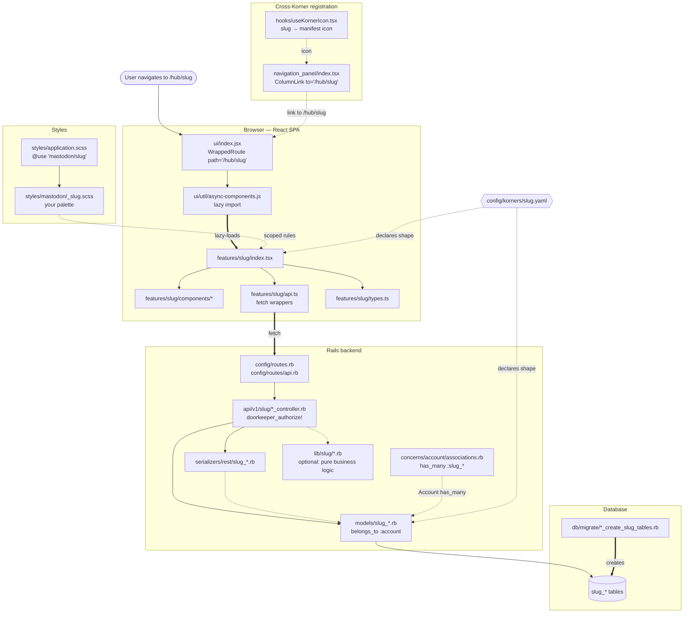
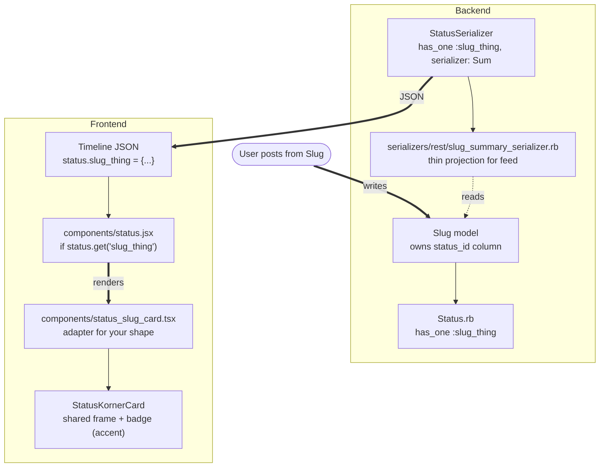

# Adding a Korner

> **Stale (pre-2.0.0):** the planet system (`planets.tsx`, `SPACE_PLANET`,
> `spaceColor()`, `--space-color`) referenced throughout this walkthrough
> has been retired. Every Korner now inherits the shared Kronk-purple
> accent from `_tokens.scss` — no per-Korner planet or colour assignment.
> Use `var(--accent)` in SCSS directly. Steps here that ask you to edit
> `planets.tsx` or set `--space-color` no longer apply. The rest of the
> flow (models, controllers, feature module, registration) is still
> broadly correct. See `docs/korners/adding_a_korner.md (Framework spec (v0.5))` for the current
> authoritative framework.

**Audience:** developers building a new Korner (space) inside Kronk.
**Reference implementation:** Klot (cycle tracker), landed on `dev/tbone`.
**Read alongside:** [`the Framework spec (v0.5) part of this file`](adding_a_korner.md).
**Aesthetic reference:** [`the Framework spec (v0.5) part of this file` §3](adding_a_korner.md) covers the shared palette, typography, radius scale, elevation, motion, and the `/styleguide` living reference. **Read §3 before you write any SCSS.** Every Korner composes against those tokens; the stylelint config rejects hardcoded hex codes, radii, durations, and shadows in Korner-owned SCSS files. Add your new SCSS file to the override list in `stylelint.config.js` when you create it.
**Visual companion:** [`the Anatomy part of this file`](adding_a_korner.md) — two diagrams showing how the pieces connect.

This walkthrough describes the pattern **as the codebase actually implements
it today**, not as the spec ultimately wants it. Where the two diverge, each
step calls it out with a **[Spec drift]** callout so you can see what's
provisional and what's stable.

The goal: after following this doc end-to-end, a new Korner is visible in the
nav, its data is stored in `<slug>_*` tables, its API is under
`/api/v1/<slug>/`, and its posts render as unified `StatusKornerCard`
components in the feed.

---

## 0. Decide the shape before you write code

Answer these five questions before touching the repo. Every subsequent step
follows from these answers.

| Question                                                                                               | Klot's answer                                        |
| ------------------------------------------------------------------------------------------------------ | ---------------------------------------------------- |
| **Slug** — **one lowercase word**, used everywhere (route, table prefix, i18n keys, manifest filename) | `klot`                                               |
| **Korner name** — TitleCase, used in UI copy. One word too                                             | `Klot`                                               |
| **What does a post from this Korner look like?** — the feed projection                                 | A shared cycle log entry with phase-of-cycle + emoji |
| **What are the primary nouns?** — one Ruby model per noun, table name `<slug>_<noun>`                  | `KlotPeriod`, `KlotSetting`, `KlotShare`             |

If any of these is unclear, stop here and clarify. Retro-fitting a slug change
is painful — see the warning below.

> ### The slug is one lowercase word. No hyphens, no underscores.
>
> This is **Standard L1**, and `korners doctor` enforces it:
>
> - one lowercase word — `inflow`, not `in-flow` or `in_flow`
> - **identical to the manifest filename** — slug `inflow` ⇒ `config/korners/inflow.yaml`
> - not in `config/korners/reserved_slugs.yaml`, and unique across korners
>
> The slug is the URL (`/hub/<slug>`), the manifest filename, the feature
> directory, the table prefix and the i18n key root. Every one of those has to
> agree, so pick a word that works as all five.
>
> In Flow is the cautionary tale. It shipped as filename `in_flow.yaml`, slug
> `in-flow` and display name "In Flow" — three forms of one name, which meant
> `useKorner('in-flow')` and the icon map keyed on a string that matched
> neither the file nor the directory. Renaming it after the fact touched the
> manifest, four route entries, the API namespace, the controller class, the
> feature directory, the stylesheet, three specs and two docs, and needed
> permanent 301s because the old URLs were already in the wild.
>
> If the name you want is two words, join them (`inflow`) or choose another.
> Do not hyphenate.

The spec (§1) mandates a `config/korners/<slug>.yaml` manifest that declares
slug/nouns before any code is written. Registration is now validated by
`bin/tootctl korners doctor` (it gates L1/L3/L4/L5/L10 for `enforced` korners),
though mounting a Korner is not hard-refused on a missing manifest. You'll write
the manifest at the end of this walkthrough (see §12); do the five-question
exercise up front anyway.

---

## 1. Model your data

**Files:**

- `db/migrate/<timestamp>_create_<slug>_tables.rb`
- `app/models/<slug>_<noun>.rb` — one per noun

**Storage discipline** (spec §5.1): every table this Korner owns starts with
the slug. Klot ships three tables — all prefixed:

```ruby
# db/migrate/20260708230001_create_klot_tables.rb
class CreateKlotTables < ActiveRecord::Migration[8.0]
  def change
    create_table :klot_periods do |t|
      t.references :account, null: false, foreign_key: { on_delete: :cascade }
      t.date :started_on, null: false
      t.timestamps
    end
    add_index :klot_periods, [:account_id, :started_on], unique: true

    create_table :klot_settings do |t|
      t.references :account, null: false,
                   foreign_key: { on_delete: :cascade },
                   index: { unique: true }
      t.integer :cycle_length, default: 28, null: false
      t.integer :period_length, default: 5, null: false
      t.timestamps
    end

    create_table :klot_shares do |t|
      t.references :account, null: false, foreign_key: { on_delete: :cascade }
      t.bigint :viewer_account_id, null: false
      t.timestamps
    end
    add_index :klot_shares, [:account_id, :viewer_account_id],
              unique: true, name: 'index_klot_shares_unique'
  end
end
```

Each model belongs to `Account` and includes just the scopes it needs:

```ruby
# app/models/klot_period.rb
class KlotPeriod < ApplicationRecord
  belongs_to :account

  validates :started_on, presence: true
  validates :started_on, uniqueness: { scope: :account_id }

  scope :for_account,       ->(account) { where(account: account) }
  scope :most_recent_first, -> { order(started_on: :desc) }
end
```

### The migration pattern for feed-projected Korners

If your Korner posts to the feed (see §11), your primary table needs one
extra column: the status the share posts as. Follow this exact shape —
`strong_migrations` will block anything else on staging/production:

```ruby
class AddStatusIdToYourTable < ActiveRecord::Migration[8.0]
  disable_ddl_transaction!

  def change
    add_reference :your_table, :status, null: true,
                                        index: { unique: true, algorithm: :concurrently }
  end
end
```

**No `foreign_key:` argument.** Kronk uses Ruby-level `dependent: :nullify`
on the `Status has_one :your_thing` for cascade. Adding a DB-level FK is
what `strong_migrations` refuses (adding a FK locks writes on both tables).
Every existing feed-projected Korner (`events`, `wachuneed`/`listings`,
`booth_sets`) follows this pattern.

### Column naming — use `status_id`

The existing Korners have drifted here:

| Korner    | Column                           | Notes                           |
| --------- | -------------------------------- | ------------------------------- |
| Kalendar  | `events.status_id`               | Canonical                       |
| Wachuneed | `listings.status_id`             | Canonical                       |
| Booth     | `booth_sets.shared_status_id`    | Legacy — kept for compatibility |
| Kommons   | `proposals.discussion_status_id` | Legacy — kept for compatibility |

**For a new Korner, use `status_id`.** Two of four existing Korners agree,
the naming is shorter, and it's what the ORM naturally infers from
`belongs_to :status`. Leave the legacy names alone in Booth and Kommons —
migrating them would ripple through model/serializer/discriminator without
buying much.

---

**Do not** add associations from `Account` back to your models. Kronk uses
concerns for that:

```ruby
# app/models/concerns/account/associations.rb (existing file — add your line)
has_many :klot_periods, dependent: :destroy
has_many :klot_settings, dependent: :destroy
has_many :klot_shares,  dependent: :destroy
```

**[Spec drift]** Spec §5.6 requires snowflake IDs so status references
survive migration between hosts. Klot uses default `bigint(8)` PKs. This is
fleet-wide drift — no Korner has adopted snowflakes yet. Match the existing
pattern for now; snowflake migration is a future cross-Korner change.

---

## 2. Server-side controllers

Kronk uses **two controller trees** for every Korner:

### 2a. The page controller (`app/controllers/<slug>_controller.rb`)

For most Korners this is a tiny shim that just renders the SPA shell.
Klot's is unusual in that it has its own `KlotController` for server-rendered
share pages, but many Korners get away with piggy-backing on `HomeController`
via a wildcard route (see §7). Start with the wildcard route if you don't
need server-rendered pages.

### Never call PostStatusService inside a transaction

If any of your controllers posts a status to the feed (share endpoints,
auto-post-on-create flows like Kalendar events), the call **must not**
be wrapped in an `ApplicationRecord.transaction` block:

```ruby
# WRONG — silently drops the status from home feeds
ApplicationRecord.transaction do
  @thing.save!
  @status = PostStatusService.new.call(current_account, text: ...)
  @thing.update!(status_id: @status.id)
end

# RIGHT — save first, post status outside the transaction
@thing.save!
@status = PostStatusService.new.call(current_account, text: ...)
@thing.update!(status_id: @status.id)
```

**Why:** `PostStatusService` enqueues `DistributionWorker.perform_async`
during its call. Sidekiq starts the fanout job immediately — before your
outer transaction commits. Inside the job, `Status.find(status_id)` raises
`ActiveRecord::RecordNotFound`, which `DistributionWorker#perform` rescues
silently. The status ends up in the DB when the transaction commits, but
its fanout to home feeds never runs. The status is visible on the author's
profile and via direct URL — but the home feed never gets it.

This is the exact bug we hit on Kalendar's event creation. Booth's share
endpoint was already correct.

Trade-off: if `PostStatusService` fails after your save succeeded, you
get an orphan primary row with no linked status. Preferable to the silent
fanout failure — the user can retry or delete.

### 2b. The API controllers (`app/controllers/api/v1/<slug>/`)

**Namespace them under `Api::V1::<Slug>::`.** Klot has four:

```
app/controllers/api/v1/klot/periods_controller.rb   # CRUD on periods
app/controllers/api/v1/klot/phases_controller.rb    # derived phase-of-cycle
app/controllers/api/v1/klot/settings_controller.rb  # cycle length etc.
app/controllers/api/v1/klot/shares_controller.rb    # who can see whose data
```

Each inherits from `Api::BaseController`, calls `doorkeeper_authorize!` with
appropriate scopes, and uses `current_account` to scope to the caller. Keep
these thin — business logic lives in `app/lib/<slug>/` if it's substantial.

**[Spec drift]** Spec §7 mandates a single authorisation layer. Today each
Korner authorises independently — Kommons uses one pattern, Klot uses another,
Wachuneed a third. Follow the pattern of whichever Korner is closest to
yours in shape until the auth-layer consolidation lands (Phase 2).

---

## 3. Serializers

**Files:** `app/serializers/rest/<slug>_<noun>_serializer.rb`

Kronk's serializers live under `app/serializers/rest/` and inherit from
`ActiveModel::Serializer`. Klot ships four — one per model plus one for
derived phase data:

```ruby
# app/serializers/rest/klot_period_serializer.rb
class REST::KlotPeriodSerializer < ActiveModel::Serializer
  attributes :id, :started_on
end
```

For a Korner whose posts show up in the feed (see §11), you'll also need a
**summary serializer** — a thin projection exposed on `Status` for the feed
card. See how `REST::WachuneedListingSummarySerializer` handles this on
`dev/kashka`.

---

## 3.5. Chrome the Frame provides — don't build these

**Read [`docs/design.md (Frame)`](../design.md) before writing any UI.** The Frame is the grid every korner renders inside, and it already draws three pieces of chrome for you off the manifest. If your feature file draws them again you'll get a doubled surface — this is exactly the bug Klot shipped in alpha.223 and had to fix in alpha.225 (`bin/tootctl korners doctor` catches it now, as a warning under Standard L11).

| Slot                      | Frame component         | Manifest field                           | You render this in your index?                                                                                                                           |
| ------------------------- | ----------------------- | ---------------------------------------- | -------------------------------------------------------------------------------------------------------------------------------------------------------- |
| Space badge (chrome)      | `<AutoSpaceBadge>`      | `name`                                   | **No.** The badge is the persistent top-left `[← Klot]` pill that stays visible as content scrolls. It's the back affordance.                            |
| Space header (in-content) | `<AutoSpaceHeader>`     | `name` + `tagline`                       | **No.** The header renders `<h1>{name}</h1>` above the tagline at the top of the Stage's scrollable region — it scrolls with content. Don't emit either. |
| View / tab row            | `<AutoSpaceViewPicker>` | `views:` (ordered `[{ key, label }, …]`) | **No.** Don't emit `role="tablist"` or a bespoke tab class.                                                                                              |

The view picker is URL-driven: bare `/hub/<slug>` is your first-listed view; `/hub/<slug>/<key>` is any other. Your component should read `useLocation()` and switch on the segment — never a `useState<Tab>` tab state.

**A minimal Frame-adherent korner looks like:**

```tsx
// features/mykorner/index.tsx
import { KornerShell } from 'mastodon/components/korner_shell';

export const MyKorner: React.FC = () => (
  <KornerShell
    slug='mykorner'
    label='MyKorner'
    className='mykorner'
    defaultView='default'
    views={{
      default: () => <DefaultView />,
      other: () => <OtherView />,
    }}
  />
);
```

That's it — no hero, no tab row, no tagline. `<KornerShell>` owns the `<Stage>` wrapper and the URL-to-view routing; the view keys line up with the manifest's `views:` list. Copy the shape from `docs/korners/template/` and delete the parts you don't need.

Landing-view copy that _isn't_ the tagline (a lede paragraph, a getting-started card, a call-to-action) is fine — it's your content, not chrome. The rule is against duplicating what the Frame already renders. Standard L11 spells this out.

---

## 4. Frontend feature module

**Directory:** `app/javascript/mastodon/features/<slug>/`

Klot's shape:

```
features/klot/
├── index.tsx                    # the mounted route component
├── api.ts                       # thin fetch wrappers around /api/v1/klot/
├── phase_math.ts                # pure derivation helpers, unit-testable
├── types.ts                     # TypeScript types shared across the module
└── components/
    ├── cycle_ring.tsx
    ├── log_card.tsx
    ├── moon.tsx
    ├── settings_card.tsx
    └── share_card.tsx
```

**Conventions worth copying from Klot:**

- **`api.ts` isolates fetch calls.** Every network call the Korner makes goes
  through this file. Redux stays out of it — Klot uses local state and hooks.
- **Pure helpers get their own file.** `phase_math.ts` has zero side effects
  and no React. Makes phase logic unit-testable in isolation.
- **Types in one place.** `types.ts` is the source of truth for what a
  `KlotPeriod` looks like on the client.
- **Components are named for what they _are_, not what they _do_.**
  `cycle_ring.tsx`, not `phase_visualiser.tsx`.

Use `var(--accent)` (from `_tokens.scss`) for borders, glows, and tints.
Everything nested picks up the shared Kronk-purple accent — no per-Korner
colour derivation. `color-mix()` on `var(--accent)` is fine where a
softer shade is needed. (Prior to 2.0.0 this went through `--space-color`
and `spaceColor()`; both were retired.)

**[Spec drift]** The spec (§3) requires every Korner declare a language
schema — the verbs and nouns your Korner introduces. Klot's language is
implicit in its component names. Aim for consistency (`period`, `phase`,
`cycle`, `share`) but nothing enforces it yet.

---

## 5. Register the frontend chunk

Two file edits, both under `app/javascript/mastodon/features/ui/`:

### 5a. `util/async-components.js`

Add the dynamic import so the bundle can code-split your Korner:

```js
export function Klot() {
  return import('../../klot');
}
```

### 5b. `index.jsx`

Import the async component and wire it as a route:

```jsx
// near the top with the other async imports:
import { ..., Klot, ... } from './util/async-components';

// in the render tree, inside <SignedIn>:
{signedIn && <WrappedRoute path="/hub/klot" component={Klot} content={children} />}
```

Klot's route is auth-gated with `{signedIn && ...}` because it shows personal
health data. If your Korner is public, drop the guard.

**Every Korner mounts under `/hub/<slug>`.** This is live and universal — the
URL migration (spec §4) shipped, every existing Korner is at `/hub/<slug>`,
and legacy top-level `/<slug>` paths 301-redirect to `/hub/<slug>` in
`config/routes.rb`. Do **not** mount at bare `/<slug>`.

---

## 6. Rails routes

**File:** `config/routes.rb`

For the SPA shell (client-side routing takes over) — mount under `/hub/`:

```ruby
get '/hub/klot', to: 'home#index'
get '/hub/klot/*path', to: 'home#index', format: false
```

If you have server-rendered pages (share cards, embeds), add explicit routes
**above** the wildcard so they take precedence — see how Booth handles
`/hub/booth/sets/:id/embed`.

**File:** `config/routes/api.rb`

Wrap your API controllers in a namespace:

```ruby
namespace :klot do
  resources :periods, only: [:index, :create, :destroy]
  resource :settings, only: [:show, :update]
  resources :shares, only: [:index, :create, :destroy]
  resources :phases, only: [:index]
end
```

---

## 7. Styles

**File:** `app/javascript/styles/mastodon/_<slug>.scss`

Create the partial, prefix every selector with your Korner's namespace, and
build against the shared design tokens — **no raw hex codes**:

```scss
// app/javascript/styles/mastodon/_klot.scss
@use 'variables' as *;

.klot-page {
  background: var(--surface);
  border-color: var(--accent);
  // ... derive shades with color-mix() on var(--accent) where needed
}
```

The token system has shipped: tokens are authored in
`app/javascript/mastodon/tokens/tokens.yaml`, generated into
`_tokens.scss` by `bin/generate-tokens`, and enforced. Korner-owned SCSS
must not inline hex values — stylelint's `color-no-hex` rejects them, and
`korners doctor` check L7 requires your SCSS file be added to the stylelint
governance list (the `files:` array under the token-enforcing overrides in
`stylelint.config.js`). Use `var(--accent)` and the other semantic tokens.

**File:** `app/javascript/styles/application.scss`

Add a `@use` line — alphabetise:

```scss
@use 'mastodon/klot';
```

Don't touch `components.scss` or `basics.scss`. Your styles are yours; keep
them in the partial.

---

## 8. Accent colour — nothing to do

Korners do not have their own colour. There is no planet to register and no
`SPACE_PLANET` entry to add; the planet system was retired on 2026-07-10 and
`planets.tsx` is gone.

Every korner uses the shared palette via `var(--accent)`, which also means it
picks up each user's Personal Appearance settings for free. Differentiation is
icon, name and content — see Standard L1 ("No colour field") and
`docs/design.md (Aesthetic system)`.

## 9. Navigation panel

**File:** `app/javascript/mastodon/features/navigation_panel/index.tsx`

Add a `ColumnLink` for your Korner alongside the others:

```tsx
<ColumnLink
  transparent
  to='/hub/klot'
  icon='moon'
  text={intl.formatMessage(messages.klot)}
/>
```

Add a matching entry to the `messages` object with the display label.

**[Spec drift]** Klot is currently not in the nav panel — it's reachable only
by URL. Every Korner **should** be discoverable from the nav. Add yours here
so it's not the same drift item. (Klot's absence is captured in
`config/korners/klot.yaml` under `discoverable: false`.)

---

## 9.5. The icon

**File:** `app/javascript/mastodon/hooks/useKornerIcon.tsx`

Your manifest names an icon:

```yaml
icon:
  material: kronikles
```

Whatever name you put there has to exist as a key in `MATERIAL_TO_ICON` in
`useKornerIcon.tsx`, which is the only icon lookup for chrome, column headers
and dropdowns. Two steps:

1. Drop the SVG into `app/javascript/material-icons/400-24px/<name>.svg` —
   24px, `viewBox="0 -960 960 960"`, single path, like the 340-odd already
   there.
2. Import it and add the row, both in alphabetical order.

**A Kronk glyph is the destination; a Material Symbol is scaffolding.** The
folder holds both: Google's outlined symbols, and Kronk's own drawings
(`kuestion`, `spiral`, `in_flow`, `kronk_coin`, `choice`, `raven`, `zhong`,
`cinema`, `kronikles`…). Starting on a Material Symbol so the korner is not
iconless is fine — that is what Cinema and Kronikles did — but a korner is
not finished wearing a stock glyph, and swapping later is a one-line manifest
change plus a row here (#1813). Name a Kronk glyph after the korner rather
than after what it depicts.

If you skip this, nothing breaks loudly: your korner silently wears the
default glyph everywhere. Three korners in a row shipped that way on
2026-09-11 (Art, Kronikles, Cinema), which is why there is now a spec —
`spec/lib/kronk/korner_registry_icons_spec.rb` — that fails on the pull
request rather than leaving it to be noticed.

---

## 9.6. The Kommons Directory

**Nothing to wire.** The Directory tree at `/hub/kommons/directory` builds
itself from the node registry, so the `nodes:` block in your manifest is what
puts your korner on it:

```yaml
nodes:
  - id: kronikles.index
    label: Kronikles
    url: /hub/kronikles
    lifecycle: live
    spa: true
```

A korner node defaults to `bucket: hub` and `parent: <slug>`, so the plain
form above is usually all you need. What the tree does with it:

- **One node** — your korner is a leaf, and tapping it opens its space page.
- **Several nodes** — your korner becomes a branch that expands to them
  (Kommons does this: Proposals / Directory / Proposer).
- **Parameterised routes** (anything with `:id` in the URL) are treated as
  internal templates and left off the tree.

Every node gets a page of its own at `/hub/kommons/node/<id>`, which is where
people propose changes to that part of Kronk. That is the point of the
Directory: **a space that is not on the tree cannot be proposed about.** So
declare a node for every page of your korner a person can navigate to and
might want changed.

---

## 10. The Hub

Spec §4 says your Korner appears as a tile in the Hub grid at `/hub`. **The Hub
is shipped** — `app/javascript/mastodon/features/hub/index.tsx`. You do **not**
register your Korner with it by hand: the grid renders from the Korner registry,
so a registered manifest with a Hub-facing node is enough to appear. There is no
`hub_registered` manifest field. Tile ordering is by tune-in count with a
per-user override (§4); nothing to wire per-Korner.

---

## 11. Feed projection — how posts appear in the timeline

If your Korner emits statuses (posts) that need to render as space cards in
the home timeline, the spec (§8) calls this **feed projection**. There are
three moving parts:

### Reference implementations

Four Korners currently ship feed projection. Copy the closest match to
your shape:

| Korner        | Best for                                                                                                                                                                                                                                                           | Reference files                                                                                                                                                                      |
| ------------- | ------------------------------------------------------------------------------------------------------------------------------------------------------------------------------------------------------------------------------------------------------------------ | ------------------------------------------------------------------------------------------------------------------------------------------------------------------------------------ |
| **Kommons**   | You have a first-class resource (proposal, decision) with a discussion attached                                                                                                                                                                                    | `app/models/proposal.rb`, `app/controllers/api/v1/proposals_controller.rb`, `app/serializers/rest/proposal_summary_serializer.rb`                                                    |
| **Kuestions** | Dedicated `Question`/`Answer` tables; its feed card is **not yet re-added** — the old Status-polymorphic `question_card` retired (Phase 3a) and a `Question`-model-backed `kuestions_card` is still to build, so there is currently no `KORNER_CARDS` entry for it | `app/models/question.rb`, `app/models/answer.rb`, `app/javascript/mastodon/components/korner_cards.tsx` (see the Kuestions comment)                                                  |
| **Kalendar**  | You have a primary record (event, workshop) that gets shared on create                                                                                                                                                                                             | `app/controllers/api/v1/events_controller.rb#create` (post-race-fix — status creation is outside the transaction), `app/models/event.rb`, `app/serializers/rest/event_serializer.rb` |
| **Booth**     | You have a primary record (audio set, upload) with an explicit share action                                                                                                                                                                                        | `app/controllers/api/v1/booth_sets_controller.rb#share`, `app/models/booth_set.rb`, `app/serializers/rest/booth_set_summary_serializer.rb`                                           |

### 11a. Association on `Status`

Your Korner attaches to a status via `has_one`:

```ruby
# app/models/status.rb (or a concern) — one line per Korner
has_one :listing, dependent: :nullify   # Wachuneed
has_one :booth_share,         dependent: :nullify   # spec drift — see below
```

### 11b. Serializer exposure

Add a `has_one` in `REST::StatusSerializer` pointing at a **summary**
serializer — deliberately thin, so the timeline JSON stays small. Look at
`REST::WachuneedListingSummarySerializer` as the template.

### 11c. Adapter component

Create `app/javascript/mastodon/components/status_<slug>_card.tsx` that
renders your Korner's data through the shared `StatusKornerCard` frame.
Same anatomy for every Korner — see `status_wachuneed_card.tsx` and
`status_booth_card.tsx` as templates.

The rendering discriminator is the **card registry** at
`app/javascript/mastodon/components/korner_cards.tsx` — `KORNER_CARDS` is
an array of `{ slug, matches, card }` entries, and `pickKornerCard` /
`hasKornerCard` walk it. `status.jsx` imports those two helpers; it no
longer carries a per-Korner `if/else` branch chain. To add a feed Korner,
register one `KORNER_CARDS` entry:

```tsx
// app/javascript/mastodon/components/korner_cards.tsx
{
  slug: 'klot',
  matches: (s) => s.get('klot_share') != null,
  card: (s) => <StatusKlotCard share={dataFrom(s, 'klot_share')} />,
},
```

`hasKornerCard(status)` also drives the suppression of the raw text body,
so a registered card automatically hides the underlying post text — there
is no separate suppression list to edit.

Booth's projection is now wired end-to-end: `booth_sets` carries both a
`shared_status_id` and a `status_id` column, `Status has_one :booth_set`
resolves, and `korner_cards.tsx` has a `booth` entry, so a shared set
renders its card in the timeline.

---

## 11.5. Compose action — declare `compose:` and let the Kronk bubble host it

**Never build a per-page "Add" / "New X" / "Create" button.** Every korner's
compose action belongs in the floating Kronk menu (`features/ui/components/
kronk_menu.tsx`), which reads two fields from your manifest and renders the
button for you:

```yaml
compose:
  label: 'New album' # or 'Ask a Kuestion', 'Open a Proposal', etc.
  route: '/hub/<slug>/<action>' # the SPA route the bubble navigates to
```

While the viewer is anywhere under `/hub/<slug>`, the bubble's Post action
picks up `label` + `route` via `useKorner()` and the button Just Works —
across every korner, in one place, with one look. Skip the block and your
korner silently has no Post affordance from the bubble.

**Wire the route.** Add the compose route to `features/ui/index.jsx`
alongside your korner's other routes. The most idiomatic pattern is for
the compose route to mount your korner's shell component with a
"composer open" prop (e.g. Albutts's `/hub/albutts/new` mounts the
directory with `autoOpenComposer`, Kuestions's `/hub/kuestions/ask`
dispatches to the Ask panel). Kommons goes a step further — the Ж
menu appends a `?space=<slug>` query param when the viewer is on a
Kommons space page, so the proposer opens scoped to that space (see
`kronk_menu.tsx` `usePostTarget` for the pattern).

**No per-page button.** If you added a "New X" button somewhere on your
directory / landing / detail page while prototyping, retire it before the
korner ships. The empty-state copy should point the user at the Kronk menu
instead of a click target, e.g. _"No albums yet — start one via the Ж
menu."_ This keeps compose ergonomics uniform across every korner.

Currently in-compliance: Album, Booth, Kalendar, Kommons, Krew, Kuestions,
mARTketplace, Map, Moment. Only Albutts had slipped through the crack
(fixed 2026-07-30 in the same PR that landed this doc section).

---

## 12. Write the manifest

**File:** `config/korners/<slug>.yaml`

Land the manifest as part of your PR — `bin/tootctl korners doctor` reads it
and gates conformance (see §0: L1/L3/L4/L5/L10 for `enforced` korners, plus
the L7 SCSS-token check). It's also the machine-readable record of the
decisions you made in §0 and the drift you accepted along the way. Copy one
of the existing manifests as a starting point — `klot.yaml` is the newest
and cleanest.

Mark drift honestly:

- `# not-implemented` — spec says the field should be filled, you haven't
- `# implicit` — the code does this thing but it's not declared explicitly
- `# TODO` — you know it needs doing before the Korner is spec-conformant
- `# not-applicable` — the field doesn't apply to your Korner's shape

`bin/tootctl korners doctor` reads these manifests and reports drift back to
you. Marking honestly costs nothing; marking optimistically costs the next
dev's afternoon.

---

## 12.5. Write the spec doc

**File:** `docs/spaces/<slug>.md`

The spec doc is the human-readable companion to the manifest — what the
korner is _for_, what it isn't, how surfaces work, where the shape came
from. It's what portal-me and every other agent reads to stay in sync;
it's what the next dev reaches for before touching anything you shipped.

**This is required for `enforced: true` korners.** `bin/lint-korner-docs`
runs in the `lint` CI job (a required merge-queue gate) and fails the
build if any enforced korner is missing its doc. A scaffold korner
(`enforced: false`) is exempt — write the doc when you flip the flag to
`true`. See [`../spaces/README.md`](../spaces/README.md) for the shape
and [`../spaces/albutts.md`](../spaces/albutts.md) or
[`../spaces/moments.md`](../spaces/moments.md) as the reference depth.

Sections to include (roughly, in order):

- **Purpose** — one paragraph on what the korner enables that no other
  korner does. Why it exists.
- **What a `<primary>` is** — the fields, the shape of a single record,
  the visibility model.
- **Where you see it** — the surfaces (directory, detail, feed card,
  cross-korner attach points).
- **Composer** — the fields the composer offers, the submit flow.
- **Feed projection** — how the korner projects to the timeline.
- **Data** — the tables, the associations, storage notes.
- **Nodes** — the tree entries.
- **Open decisions** — what's deferred, what's ambiguous, what a
  future round of design has to answer.
- **Related** — links to sibling korners, the Standard, the walkthrough.

Also add a row to the `docs/spaces/README.md` korner table.

---

## 13. Testing

Once merged locally:

```bash
bundle exec rails db:migrate
yarn dev  # or just RAILS_ENV=development bundle exec rails s
```

Hit `/hub/<slug>` in a browser signed in as any account. Then:

- Load a post from your Korner into the home timeline — verify the shared
  card frame renders with the shared accent colour.
- Check the nav panel — your Korner's link should be there and highlighted
  when active.
- Check the Hub tile and your column header — if either shows a generic
  glyph, your icon is not wired (§9.5).
- Check `/hub/kommons/directory` — your korner should be on the tree without
  you having touched it (§9.6). If it is missing, your manifest has no
  `nodes:` block.
- Log out — verify the auth gate on `/api/v1/<slug>/*` returns 401 (or
  whatever your Korner's public surface should be).

Then open a PR against `shadow` and confirm on
[shadow.kronk.info](https://shadow.kronk.info), which auto-deploys from that
branch a couple of minutes after a merge. (`staging` was retired as a deploy
branch on 2026-07-30 and this walkthrough still said to merge into it.) See
CLAUDE.md for the full branch/PR workflow.

---

## Appendix: Files touched, in order

For a Korner with a full frontend+backend+feed presence, the merge diff
should touch approximately:

| File                                                           | Purpose                                  |
| -------------------------------------------------------------- | ---------------------------------------- |
| `db/migrate/*_create_<slug>_tables.rb`                         | Schema                                   |
| `app/models/<slug>_*.rb`                                       | Ruby models                              |
| `app/models/concerns/account/associations.rb`                  | `Account has_many` line                  |
| `app/controllers/<slug>_controller.rb`                         | (Optional) server-rendered pages         |
| `app/controllers/api/v1/<slug>/*_controller.rb`                | JSON API                                 |
| `app/serializers/rest/<slug>_*_serializer.rb`                  | JSON shape                               |
| `app/lib/<slug>/*.rb`                                          | Business logic (if substantial)          |
| `config/routes.rb`                                             | SPA shell routes                         |
| `config/routes/api.rb`                                         | API routes                               |
| `app/javascript/mastodon/features/<slug>/**/*`                 | Frontend feature module                  |
| `app/javascript/mastodon/features/ui/util/async-components.js` | Chunk registration                       |
| `app/javascript/mastodon/features/ui/index.jsx`                | Route registration                       |
| `app/javascript/mastodon/features/navigation_panel/index.tsx`  | Nav entry                                |
| `app/javascript/mastodon/hooks/useKornerIcon.tsx`              | Icon row (and the SVG beside it)         |
| `app/javascript/styles/mastodon/_<slug>.scss`                  | Styles                                   |
| `app/javascript/styles/application.scss`                       | `@use` import                            |
| `app/models/status.rb` (if feed-projected)                     | `has_one` association                    |
| `app/serializers/rest/status_serializer.rb`                    | Timeline JSON exposure                   |
| `app/serializers/rest/<slug>_summary_serializer.rb`            | Card projection                          |
| `app/javascript/mastodon/components/status_<slug>_card.tsx`    | Feed card                                |
| `app/javascript/mastodon/components/korner_cards.tsx`          | `KORNER_CARDS` registry entry            |
| `config/korners/<slug>.yaml`                                   | Manifest (incl. `nodes:`)                |
| `docs/spaces/<slug>.md`                                        | Spec doc (required for `enforced: true`) |

That's ~18–22 files for a Korner with feed presence, ~14–16 for one without.

Everything above is the pattern **as it exists today**. The spec's endpoint
is a Korner that ships in half that many touchpoints because manifest-driven
registration collapses many of these into one file. Getting there is Phase 3.
For now: match the pattern, mark the drift, and land your Korner.

---

## Proposing a korner

_Merged into this file on 2026-10-04 from `docs/korners/adding_a_korner.md (Proposing a korner)`; its own status notes and dates are kept as written._

Discovery-phase companion to [`adding_a_korner.md`](adding_a_korner.md). When someone suggests a new korner, use this doc to run the standard **two-round question flow** that produces:

- A draft `docs/spaces/<slug>.md` in the repo (PR).
- A skeleton `config/korners/<slug>.yaml` manifest with `enforced: false` + `lifecycle: soon` (per Korner Standard §L1 golden rule).
- An entry in `docs/spaces/README.md` index.

`adding_a_korner.md` picks up from that skeleton and walks the code work end to end.

---

### Read this first

Before authoring anything: [`korner_standard.md`](korner_standard.md). The Standard's L1–L7 (identity, data, API, projection, mount, tree, aesthetic) is what a live korner must satisfy; a `soon`-stage stub still owes L1 + L5 + L6 + L7. Skipping this step is what got the YOU-korner initial ship non-conformant (see PR #354 → PR #355 retrofit).

Also verify the proposed slug against `config/korners/reserved_slugs.yaml` — reserved platform stems can't be claimed.

---

### Round 1 — ten topics

The canonical opening set. Ask in one or two batches via `AskUserQuestion` (mode allows 1–4 questions per call). Answers map directly to manifest fields; the Round 1 output IS the initial draft.

| #   | Topic                                                                                    | Format                 | Maps to manifest field                  |
| --- | ---------------------------------------------------------------------------------------- | ---------------------- | --------------------------------------- |
| 1   | **Description** — what is this korner for?                                               | Open free-text         | `hub_teaser.static` / `launch.blurb`    |
| 2   | **Primary content unit** — what do users create here?                                    | Open free-text         | `resources:` (models)                   |
| 3   | **Composer** — does the korner need one?                                                 | Y/N (drill in R2 if Y) | UI + `write:` permissions               |
| 4   | **Visibility** — public / mates / krew-scoped / direct?                                  | Multi-select           | `security.visibility_scopes:`           |
| 5   | **Storage/media** — does it host media (audio/video/images/files)?                       | Y/N (drill in R2 if Y) | `storage.media_prefix:`                 |
| 6   | **Notifications** — does the korner emit any?                                            | Y/N (drill in R2 if Y) | `notifications:` block                  |
| 7   | **Feed card** — does content project into Home feed?                                     | Y/N (drill in R2 if Y) | `feed_projection:` block                |
| 8   | **Kategory-taggable** — do items carry curated Kategory tags?                            | Y/N                    | `tags` gating                           |
| 9   | **Cross-korner connections** — what other korners does this touch, and how?              | Open free-text         | `emits:` + `listens:`                   |
| 10  | **User-facing settings** — does the korner give users toggles/preferences to control it? | Y/N (drill in R2 if Y) | `settings:` block + Korner Standard §L8 |

#### Suggested Round 1 batching

- **Batch A** (open text, framing): Q1 description + Q2 content unit + Q9 connections.
- **Batch B** (Y/N + multi-select): Q3 composer + Q4 visibility + Q5 storage/media.
- **Batch C** (Y/N structural): Q6 notifications + Q7 feed card + Q8 kategory + Q10 settings.

Three calls total. Adjust as makes sense for the shape of the korner being discussed.

---

### Round 2 — drilldowns

Round 2 drills into whichever Round 1 answer came back "yes" or needs sharpening. Only run the drilldowns that apply.

**If composer = yes:**

- What's the compose action? (post short text / propose a change / list an item for sale / upload audio / schedule a session / etc.)
- What are the required vs optional fields on the composer?
- What's the "post" button call to action?

**If notifications = yes:**

- What events trigger a notification? (per-notification `subject_type`)
- Default push on/off per type? (`default_push`)
- Aggregation window/key? (avoid flooding)
- Interactive (a nudge that opens something) or notice-only?

**If feed card = yes:**

- What appears on the card? (title source, summary source, thumbnail, cta)
- When does the card appear in a viewer's feed? (creator's mates? tune-in only? kategory-follow? krew members?)
- What audience sees it? (`default_visibility`)
- What does tapping the card do? (`links_to` URL grammar)

**If user-facing settings = yes:**

- Which settings? Enumerate each with `kind` (boolean / integer / string / enum / multi_enum / time), `default`, `scope` (`user` for per-account, `group`/`korner` for per-scope), and a short human `label` + `description`.
- Which live at `/hub/<slug>/settings` (per-korner) vs `/settings/*` (account-global)?
- Any tune-in gate settings? (Notification opt-in per type is often a settings-level toggle: `notify_on_<event>` booleans mirroring the `notifications:` block.)
- Any settings that carry sovereignty implications? (E.g., Klot's `share_phase_publicly` — "even when on, only accounts you've granted a KlotShare to see it. Raw dates never leave your account.")

**Cross-korner connections (from Q9):**

- Exact emit event names + payload shapes (e.g. `cinema.screening.started` payload: `screening_id, host_account_id`).
- Which korners listen and what they do with the payload.
- Any bidirectional patterns (event ↔ Krew, etc.).

**Optional Round 3** — anything still open. Not every korner needs one. Kuestions, Krew, Kalendar, Kommons, Wachuneed (then Marketplace) each ran a Round 3 during the 2.0 rebuild; simpler korners settled in two rounds.

---

### Artefacts

Once Round 1 and any Round 2 drilldowns land, produce three artefacts in a single PR against `shadow`:

#### 1. `docs/spaces/<slug>.md` — the space doc

Same shape as the existing per-space docs (see `docs/spaces/kuestions.md`, `docs/spaces/wachuneed.md` for reference structure). Standard sections:

- **Purpose** — what the korner is for (from Q1 description)
- **Current shape** — "not shipped yet" note; models/routes to come per Standard §L2
- **Rebuild vision** — the shape locked in from Round 1/2 answers
- **Open decisions** — anything still unresolved
- **Related** — cross-links to `korner_standard.md`, other space docs it touches, `adding_a_korner.md`

#### 2. `config/korners/<slug>.yaml` — the manifest skeleton

`enforced: false`, `lifecycle: soon` per Standard §L1. Fill in the fields Round 1 answered (`slug`, `name`, `icon`, empty `resources`, nested `security:` block with the visibility scopes chosen, `feed_projection` if applicable, `nodes:` block with the `<slug>.index` node at `lifecycle: soon`).

Slug follows the Standard §L1 slug rules: one lowercase word (no hyphens/underscores), matches the yaml filename, not in `reserved_slugs.yaml`.

#### 3. `docs/spaces/README.md` — add the new space

One new row in the korner-spaces table pointing at the new doc, with the manifest link + a short status note.

---

### What happens next

After the discovery-PR merges:

- Cross-korner ripples flagged in Q9 update the touched korners' `docs/spaces/<slug>.md` files as needed (separate PRs).
- When the team is ready to build the korner for real, `adding_a_korner.md` walks the code work from the manifest skeleton this discovery process produced.
- `bin/tootctl korners doctor` will already gate the manifest against Standard §3 conformance checks; the skeleton needs to pass its stage's required layers (§1 lifecycle gate).

---

### References

- Normative: [`korner_standard.md`](korner_standard.md), [`the Framework spec (v0.5) part of this file`](adding_a_korner.md), [`docs/spaces/settings.md`](../spaces/settings.md).
- Build walkthrough: [`adding_a_korner.md`](adding_a_korner.md).
- Visual companion: [`the Anatomy part of this file`](adding_a_korner.md).
- Aesthetic tokens: [`docs/design.md (Aesthetic system)`](../design.md).
- Existing space docs: [`../spaces/`](../spaces) — reference structure examples.

---

## Anatomy

_Merged into this file on 2026-10-04 from `docs/korners/adding_a_korner.md (Anatomy)`; its own status notes and dates are kept as written._

Visual companion to [adding_a_korner.md](adding_a_korner.md) and the framework
spec [the Framework spec (v0.5) part of this file](adding_a_korner.md). Two diagrams to hold the
shape in your head — the **runtime map**, and **feed projection** (the layer
only some Korners need).

Per-Korner colour identity is gone: every Korner inherits the shared
`var(--accent)` (Kronk-purple) from `_tokens.scss`, and its icon comes from the
manifest via `useKornerIcon`. The retired `planets.tsx` / `--space-color` layer
is not part of this.

### The runtime map

Everything you touch to make a new Korner exist. Solid arrows are runtime
data flow; **dotted arrows are declarative** — edited once, referenced forever.
Thick arrows highlight the two moments a Korner "activates": the lazy-load into
the SPA, and the one-time table creation.



#### Reading order

1. User navigates to `/hub/<slug>` (every korner mounts under the `/hub/` prefix; `AutoSpaceBadge` matches `^/hub/([a-z0-9-]+)`).
2. Rails matches the SPA wildcard route in `config/routes.rb` and returns the SPA shell.
3. The React route registered in `ui/index.jsx` mounts the async component for your Korner.
4. `async-components.js` lazy-loads `features/<slug>/index.tsx`.
5. Your feature module renders your components and calls `api.ts` for data.
6. `api.ts` hits `/api/v1/<slug>/*`, which dispatches to your API controller.
7. The controller authorises via Doorkeeper, scopes to `current_account`, hits the model.
8. The model reads/writes your `<slug>_*` tables.
9. The serializer projects the model into JSON on the way back.

#### The four things not in the flow

Four boxes in the diagram aren't in the request path. They're **declarative**
— edited once, referenced forever:

- **`hooks/useKornerIcon.tsx`** — maps your slug to the Material Symbol your manifest's `icon:` declares, so the Hub tile / rail / column header all show it.
- **`navigation_panel/index.tsx`** — how a user _discovers_ your Korner without knowing the URL.
- **`concerns/account/associations.rb`** — one line so `Account.first.slug_periods` works.
- **`config/korners/slug.yaml`** — machine-readable declaration of your Korner's shape, validated at boot/CI by `bin/tootctl korners doctor`.

These are the most common source of "why isn't my Korner showing up" bugs.

---

### Feed projection

Only Korners whose data appears in the home timeline need this layer.
The registry (`components/korner_cards.tsx` → `KORNER_CARDS`) currently
holds four cards: **Kalendar, Kommons, Wachuneed, Booth**. Kuestions is
_not_ a korner card — its posts render via `post_type` +
`StatusSpaceBar`, a separate path. Klot deliberately projects nothing —
its data is private.



#### Three moving pieces

- **Backend**: your model owns a `status_id`, `Status.rb` gets a matching `has_one`, and a **summary serializer** projects just the slice the timeline needs (deliberately thin, so timeline JSON stays small).
- **Timeline JSON**: the caller receives a `status` with your association populated. If it's not populated, this Korner's card doesn't fire.
- **Discriminator**: `status.jsx` picks the right card component via `pickKornerCard(status)` from the registry. Registering your card (with a `matches` predicate) also drives the body-suppression guard in `status.jsx` — the raw text body is gated behind `!hasKornerCard(status)`, so a registered card automatically suppresses it.

#### Where the drift lives

**The discriminator is now a slug-keyed registry, not a branch chain.**
`status.jsx` imports `pickKornerCard` / `hasKornerCard` from
`components/korner_cards.tsx`; adding a feed-projected Korner means adding an
entry to `KORNER_CARDS` rather than editing a `status.jsx` `if` ladder. The
remaining drift is one step further out: the registry is keyed by slug in TS,
not yet read from each manifest's `feed_projection.card` — closing that
manifest-to-registry gap is the outstanding move.

---

### Layers, at a glance

| Layer                            | Files                                                                                                   | Role                                                                                   |
| -------------------------------- | ------------------------------------------------------------------------------------------------------- | -------------------------------------------------------------------------------------- |
| **Data**                         | `db/migrate/*`, `app/models/<slug>_*.rb`                                                                | Tables, all `<slug>_` prefixed. Own only what's yours.                                 |
| **API**                          | `app/controllers/api/v1/<slug>/*.rb`, `app/serializers/rest/<slug>_*.rb`                                | JSON boundary; thin controllers, authorise via Doorkeeper.                             |
| **Routes**                       | `config/routes.rb`, `config/routes/api.rb`                                                              | SPA wildcard + `namespace :<slug>` for the API.                                        |
| **Feature module**               | `app/javascript/mastodon/features/<slug>/*`                                                             | The UI. `index.tsx` mounts, `api.ts` fetches, `components/` renders, `types.ts` types. |
| **Registration**                 | `ui/index.jsx`, `async-components.js`, `navigation_panel/*`, `hooks/useKornerIcon.tsx`                  | Cross-cutting existing-file edits that make your Korner known.                         |
| **Styles**                       | `_<slug>.scss`, `application.scss`                                                                      | One partial, one `@use` line.                                                          |
| **Feed projection** _(optional)_ | `Status.rb`, `StatusSerializer`, `<slug>_summary_serializer.rb`, `status_<slug>_card.tsx`, `status.jsx` | Only if posts from this Korner render as cards in the home timeline.                   |
| **Manifest**                     | `config/korners/<slug>.yaml`                                                                            | Declaration of your Korner's shape, validated at boot/CI by `korners doctor`.          |

Everything above is _the pattern as of today_. The spec's endpoint is a
Korner that ships in half these touchpoints because manifest-driven
registration collapses many into one file. That consolidation is ongoing.
For now: match the pattern, mark the drift.

---

## Korner attachments

_Merged into this file on 2026-10-04 from `docs/korners/adding_a_korner.md (Korner attachments)`; its own status notes and dates are kept as written._

> **Status.** Design spec, decided 2026-08-14. Normative — this is the shape
> code must follow when implementing the cross-korner attachment primitive.
> Implementation is intentionally NOT started at spec time: nail the shape
> first, then build.
>
> **Read this correctly.** The decisions in §0 are authoritative. The
> §7 open items are genuinely undecided and must not be treated as settled.
>
> **Precedence.** If code and this doc disagree, code wins — but that
> means one of the two is wrong. Fix the mismatched side in the same PR
> that surfaces it (`docs/decisions.md` 2026-07-19 lesson).

---

### 0. Decisions (authoritative)

1. **Every cross-korner connection lives in one place — the `korner_attachments` table** — instead of per-pair FK columns on individual korner tables. Existing pairs (`album.event_id`, `booth_set.event_id`) migrate to this table in Phase 3 (§5) but keep their FK columns as a passive mirror for backward-compat during the transition.
2. **Attachments are keyed by manifest slug + record id, not Rails polymorphic type.** The manifest is already the registry of what a korner is; reuse it. `Kronk::KornerRegistry.model_for("albutts")` returns the AR class. No `type` string on the row (Rails polymorphic conventions) — slug is stable across renames + reads cleanly in SQL logs.
3. **The manifest declares what attaches to what.** A korner cannot receive attachments from a korner that doesn't list it as a target — validated by `bin/tootctl korners doctor`, enforced at API-time by `KornerAttachmentPolicy#can_attach?`. Bidirectional consent is default; wildcard (`to: '*'`) is opt-in when a korner explicitly wants to be attachable from anywhere.
4. **Three kinds, one table:** `spawn` (auto-created by a source-side trigger, cascade-delete), `link` (user-added, independent lifecycle), `reference` (passive, always independent). Extend by adding new kinds — don't extend by adding new tables.
5. **The composer and detail pages get shared React primitives** (`useAttachments`, `<AttachmentSection>`, `<AttachmentPicker>`) — a new row on the platform primitives index (`docs/design.md (Platform primitives)`). New korners inherit the UX for free.

Everything below elaborates these.

---

### 1. Motivation

Kronk has three shipped cross-korner connections today, each bespoke:

| From           | To             | Shape                                                                                                   |
| -------------- | -------------- | ------------------------------------------------------------------------------------------------------- |
| Kalendar Event | Albutts Album  | `album.event_id` FK + `kalendar.event.created` subscriber in `config/initializers/albutts_event_bus.rb` |
| Kalendar Event | Booth Set      | `booth_set.event_id` FK; set via `event_id` param on booth-set create                                   |
| Kalendar Event | Huddle Session | `event.huddle_session_id` FK + `huddle` listens for `kalendar.event.created`                            |

Each new pair is a new column, a new subscriber, and a new UI. Doing this five more times (Kommons → Kalendar for a "voting deadline event," Booth → Martketplace for "buy the DJ's release," Nudges → Any-korner for "remind me about this") multiplies the surface area without any of the pairs sharing behaviour.

This spec introduces **one** join table and **one** manifest field so any future korner-to-korner connection is a config change + a UI wiring, not a schema migration + a bespoke subscriber.

---

### 2. Data model

#### 2.1 The `korner_attachments` table

```
Column                     | Type       | Notes
---------------------------|------------|-----------------------------------------------
id                         | bigint pk  |
source_slug                | string     | Kronk::KornerRegistry slug, e.g. "kalendar"
source_id                  | bigint     | id in that korner's primary resource table
target_slug                | string     |
target_id                  | bigint     |
kind                       | string     | "spawn" | "link" | "reference"
metadata                   | jsonb      | kind-specific, nullable
created_by_account_id      | bigint fk  | who created the row (author of the source
                                          record for `spawn`; the user who clicked
                                          "Attach" for `link` / `reference`)
created_at                 | datetime   |
updated_at                 | datetime   |

Indexes:
  - (source_slug, source_id)
  - (target_slug, target_id)
  - (source_slug, source_id, target_slug, target_id, kind) UNIQUE
```

**Uniqueness key includes `kind`** so the same two records can carry both a `spawn` attachment and a later user `link` without collision (edge case, but the constraint should not artificially prevent it).

**No FK on `source_id` / `target_id`** — Rails polymorphic-ish, without the `_type` column. Referential integrity is application-level; the model handles orphan cleanup (§2.3).

#### 2.2 The manifest field

Each korner's `config/korners/<slug>.yaml` declares what it attaches to and what it accepts:

```yaml
# kalendar.yaml
attaches:
  # This korner may create attachments where source = kalendar/<event.id>.
  # Each entry describes ONE (target, kind) combination.
  - to: albutts
    kind: spawn
    trigger: field:spawn_album # auto-create when `event.spawn_album` is true
    lifecycle: cascade # remove attachment when source event is deleted

  - to: booth
    kind: link
    trigger: user # user clicks "Attach a booth set"
    lifecycle: keep # deleting the event doesn't touch the booth set link

accepts:
  # This korner may receive attachments where target = kalendar/<event.id>.
  # An empty list means no korner may attach TO this one. Wildcard `*` = anyone.
  - from: nudges
    kind: reference # a Nudge can `reference` an event (e.g. a reminder)
```

- `attaches` = "I can be the source of these attachments."
- `accepts` = "I can be the target of these attachments."
- Both sides must agree — a Kalendar event can only attach to an Albutts album if `albutts.yaml` also has `accepts: [{ from: kalendar, kind: spawn }]` (or `{ from: '*', kind: spawn }`). `korners doctor` fails the boot check when consent is missing.

**Why bidirectional consent:** stops a korner drive-by-attaching to another one without the target korner's opt-in. Matches how `emits:` / `listens:` already work in Kronk's event bus.

#### 2.3 Model: `KornerAttachment`

Approximate shape (illustrative — final signatures come with the code):

```ruby
class KornerAttachment < ApplicationRecord
  belongs_to :created_by, class_name: 'Account', foreign_key: :created_by_account_id

  KIND_SPAWN     = 'spawn'
  KIND_LINK      = 'link'
  KIND_REFERENCE = 'reference'
  KINDS = [KIND_SPAWN, KIND_LINK, KIND_REFERENCE].freeze

  validates :source_slug, :target_slug, presence: true
  validates :kind, inclusion: { in: KINDS }
  validate  :manifests_agree
  validate  :records_exist

  scope :from_source, ->(slug, id) { where(source_slug: slug, source_id: id) }
  scope :to_target,   ->(slug, id) { where(target_slug: slug, target_id: id) }

  def source_record = Kronk::KornerRegistry.model_for(source_slug).find_by(id: source_id)
  def target_record = Kronk::KornerRegistry.model_for(target_slug).find_by(id: target_id)

  private

  def manifests_agree
    # source manifest must list this (target_slug, kind) in `attaches`
    # target manifest must list this (source_slug, kind) in `accepts`
    # (with '*' wildcards honoured)
  end

  def records_exist
    errors.add(:source_id, 'source record missing') if source_record.nil?
    errors.add(:target_id, 'target record missing') if target_record.nil?
  end
end
```

**Orphan cleanup:** when a source record is destroyed, its `spawn`-kind attachments AND their target records cascade-delete (matches "spawn" semantics — the target exists BECAUSE of the source). `link` and `reference` attachments only remove the join row; the target record survives. Cleanup lives in the source model:

```ruby
class Event < ApplicationRecord
  after_destroy :cleanup_korner_attachments

  private

  def cleanup_korner_attachments
    attachments = KornerAttachment.from_source('kalendar', id)
    attachments.where(kind: 'spawn').each do |a|
      a.target_record&.destroy
      a.destroy
    end
    attachments.where.not(kind: 'spawn').destroy_all
  end
end
```

The above becomes a shared `Kronk::AttachmentSource` concern that any korner includes; no per-korner boilerplate.

#### 2.4 Triggers

`spawn` attachments fire from the source-side model. Two trigger flavours declared in the manifest:

- `field:<name>` — when `record.<name>` is truthy on create, spawn. Existing `spawn_album` becomes `attaches[to: albutts, kind: spawn, trigger: field:spawn_album]`.
- `event:<korner-bus-event>` — when the named event bus event fires. Replaces the current `albutts_event_bus.rb` subscriber shape; the framework registers the subscriber on the target korner's behalf based on the manifest.
- `user` — no trigger; `link` and `reference` rows are created explicitly by a user action via the API.

The trigger runs a small factory the target korner registers (see §3.2 for how new-record shape is discovered).

---

### 3. API surface

#### 3.1 REST endpoints

```
GET    /api/v1/attachments?source=<slug>/<id>
       → [{ id, target_slug, target_id, kind, target: <serialised record> }, …]

GET    /api/v1/attachments?target=<slug>/<id>
       → same shape, target's-eye view

POST   /api/v1/attachments
       body: { source_slug, source_id, target_slug, target_id, kind, metadata? }
       → the created attachment row; 422 with the manifest-consent message
         if the two manifests don't agree.

DELETE /api/v1/attachments/:id
       → 204; only the row creator, source record owner, or target record
         owner may delete.
```

Guards in `KornerAttachmentPolicy`:

- `create`: user must own the source record (or be an admin/invitee if the source has one of those roles).
- `destroy`: user must own the source, own the target, or be the row's `created_by`.
- `index`: user must be able to see both endpoints of the attachment — if a private album is attached to a public event, someone with view access to the event but not the album shouldn't see it in the list. Filter at query time.

#### 3.2 Spawn factory registration

When a manifest declares an attachment with `trigger: field:X` or `trigger: event:Y`, the target korner needs to register a factory that turns "source record + spawn intent" into "target record." At boot:

```ruby
# in an initializer under each korner
Kronk::AttachmentFactories.register(
  source: 'kalendar',
  target: 'albutts',
  kind: 'spawn',
) do |source_record, metadata|
  Album.create!(
    owner: source_record.account,
    title: source_record.title,
    description: source_record.description.presence,
    visibility: :public
  )
end
```

The framework wires the trigger (source-side field / bus event) to the factory. Retires the bespoke subscriber in `config/initializers/albutts_event_bus.rb` — that file gets deleted in Phase 3.

---

### 4. React primitives

Adds three rows to the platform primitives index (`docs/design.md (Platform primitives)`):

#### 4.1 `useAttachments(korner, id)`

```ts
const { attached, loading, addLink, removeLink } = useAttachments(
  'kalendar',
  event.id,
);
```

- `attached` — `Array<{ id, target_slug, target_id, kind, target: any }>`, grouped by target_slug for rendering
- `loading` — boolean
- `addLink(target_slug, target_id, kind?)` — POST /attachments
- `removeLink(attachment_id)` — DELETE /attachments/:id

Uses SWR-shaped caching so multiple components on the same page share one fetch.

#### 4.2 `<AttachmentSection>`

Renders the "Attached" block on any korner detail page:

```tsx
<AttachmentSection korner='kalendar' recordId={event.id} />
```

Groups by target korner, uses each korner's own card component for the rendered rows (via the korner icon + a link to the target record). Owners of the source record see an "Add attachment" button that opens `<AttachmentPicker>`.

Sits inside a `.stage-column` (or wherever the caller mounts it). Zero configuration — the manifest declares the valid targets, so the picker knows what korners to offer.

#### 4.3 `<AttachmentPicker>`

Modal (portal-mounted, ComposeShell grammar): pick a target korner from the dropdown, then search records within that korner. Same visual family as `<MapPinPicker>` / `<ConfirmDialog>` — shared modal aesthetics.

Search reuses the korner's own search endpoint (declared in manifest as `search_endpoint`, e.g. `/api/v1/albums?q=`), or falls back to a generic `/api/v1/attachments/candidates?korner=<slug>&q=<query>` shared endpoint.

---

### 5. Migration path (phased)

| Phase | Change                                                                                                                                                                                                                                                                                                                                                                                                                                                                                                                                                                                                                                                                                                                              | Ships                              |
| ----- | ----------------------------------------------------------------------------------------------------------------------------------------------------------------------------------------------------------------------------------------------------------------------------------------------------------------------------------------------------------------------------------------------------------------------------------------------------------------------------------------------------------------------------------------------------------------------------------------------------------------------------------------------------------------------------------------------------------------------------------- | ---------------------------------- |
| 0     | This spec (`docs/korners/adding_a_korner.md (Korner attachments)`) + decisions.md entry. No code.                                                                                                                                                                                                                                                                                                                                                                                                                                                                                                                                                                                                                                   | ✓ (this PR)                        |
| 1     | Schema + model + policy + REST API + `korners doctor` validation for `attaches:` / `accepts:` manifest fields. Ships without a UI; internal API only. Registers no korners' attachments yet (all existing pairs stay bespoke).                                                                                                                                                                                                                                                                                                                                                                                                                                                                                                      | `korner_attachments` table live    |
| 2a    | React primitives that don't need per-korner support: `useAttachments` hook + `<AttachmentSection>` (read + owner remove). Add rows to `docs/design.md (Platform primitives)`. No korner adopts yet — the primitives read/write the API but the source manifests still don't opt in via `attaches:`, so mounting `<AttachmentSection>` renders empty. Isolates the client work from the manifest opt-in that arrives with Phase 3.                                                                                                                                                                                                                                                                                                   | Primitives available               |
| 2b    | `<AttachmentPicker>` modal + shared `GET /api/v1/attachments/candidates?korner=<slug>&q=<query>` endpoint (`Kronk::KornerRegistry.model_for` + `title` / `name` / `display_name` ILIKE + visibility-scoped to `current_account`). `<AttachmentSection>` gains an "Attach…" button when the viewer owns the source and the source manifest declares at least one non-wildcard, non-spawn target. Adds `attaches:` / `accepts:` to `ApiKornerJSON` + `REST::V1::KornerSerializer` so the picker can read what targets a source may reach.                                                                                                                                                                                             | Attach flow surfaced               |
| 3     | First opt-ins land — Kalendar → Albutts (spawn) + Kalendar → Booth (link) via manifest `attaches:` / `accepts:`. New `Kronk::AttachmentFactories` registry + `Kronk::AttachmentSource` model concern: source models include the concern, declare `attachment_source_slug`, and their manifest's `attaches` entries drive spawn factories on create + cascade cleanup on destroy. Backfill migration copies existing `album.event_id` + `booth_set.event_id` rows into `korner_attachments`. `albutts_event_bus.rb` deleted — its subscriber is now a factory registration under `config/initializers/attachment_factories/kalendar_albutts.rb`. FK columns kept as passive mirror; drops in a follow-up PR after consumers migrate. | Existing pairs unified             |
| 4     | The primitive becomes visible. `<AttachmentSection>` mounts on the Event detail page (`features/events/event_detail.tsx`) so authors see the "Attach…" button and every viewer sees the attached albums + booth sets. Kalendar → Huddle stays hardcoded for now (session_id has time-sensitive semantics — revisit if it fits the attachment model cleanly). FK columns still passive-mirror; drop them once every reader migrates (Phase 5, follow-up PR).                                                                                                                                                                                                                                                                         | The primitive is user-visible      |
| 5     | `albums.event_id` FK column dropped. The KornerAttachment factory + concern take over the create-time write and destroy-time cascade that the FK's `dependent: :nullify` + old `has_one :spawned_album` used to provide. `booth_sets.event_id` intentionally deferred — its column is the backing store for a user-facing composer affordance (`booth_composer.tsx` sends `event_id` on create), so dropping it moves the attach-flow from the Booth side to the Kalendar side via `<AttachmentPicker>`. That's a UX call, not a mechanical drop; splits into its own PR.                                                                                                                                                           | `albums.event_id` retired          |
| 6     | Kalendar → Huddle joins the fold. Kalendar's `attaches:` gains a `link` entry to huddle; huddle's `accepts:` mirrors it. Backfill migration copies every populated `events.huddle_session_id` into `korner_attachments` as `(kalendar, huddle, link)`. Same shape as Kalendar → Booth (link, no cascade, both records live independently). `events.huddle_session_id` stays as a passive mirror for one release cycle — Phase 6b drops it after readers migrate.                                                                                                                                                                                                                                                                    | Kalendar → Huddle in the fold      |
| 5b    | `booth_sets.event_id` FK column dropped alongside the composer's "attach event" affordance (retired `EventCombobox`). Booth uploaders lose the create-time picker; they keep the free-text `event_name` + `event_date` fields for context. Real linking now happens from the event side via `<AttachmentPicker>`. `belongs_to :event` on `BoothSet` retired; `event_id` dropped from the controller permit and REST serializer.                                                                                                                                                                                                                                                                                                     | `booth_sets.event_id` retired      |
| 6b    | `events.huddle_session_id` FK column dropped. `HuddleSession.has_one :event` retired; `Event#publish_kalendar_event_created` payload key removed; `kronk:huddle:backfill` rake task rewritten to write `korner_attachments` rows instead of the FK. Kalendar → Huddle now lives exclusively on the primitive.                                                                                                                                                                                                                                                                                                                                                                                                                       | `events.huddle_session_id` retired |

Each phase is one PR (Phase 1 might split into schema + API if it grows).

---

### 6. Access rules cheat-sheet

| Action                           | Who can do it                                                                                       |
| -------------------------------- | --------------------------------------------------------------------------------------------------- |
| Create `spawn` attachment        | Framework (via factory) on behalf of the source record's author. Never surfaced directly to a user. |
| Create `link` / `reference`      | Any user who owns the source record. Manifests must permit (source `attaches` + target `accepts`).  |
| See an attachment in the API     | User must be able to see BOTH source AND target records (each korner's own visibility rules apply). |
| Remove an attachment             | Row creator, source owner, or target owner.                                                         |
| Cascade delete on source destroy | `spawn` → target destroyed too. `link` / `reference` → row removed, target survives.                |

---

### 7. Open items

Genuinely undecided at spec time. Do not build against these until the decision lands here.

1. **Attachment ordering.** If an event has three attached booth sets, in what order do they render? By `created_at`? By an explicit `position` int? For now: `created_at DESC`. Revisit when a real use case wants curation.
2. **Cross-account attachments.** Can Alice attach her album to Bob's event (with Bob's opt-in)? Two design paths: (a) Bob invites Alice's album via a request/accept; (b) any user can attach if they own the source (and only that direction — Bob's event can't grab Alice's album without her consent). Draft leans (b) — source-owner controls. Confirm.
3. **Serialising the target record.** The API returns the attachment row + a nested target — but the target is another korner's record, and we don't want to force every korner to serialize itself over the wire on every attachments read. Options: (a) return just the reference (slug + id + title) and let the frontend fetch full records on demand; (b) return a minimal `AttachmentTargetPreview` per korner (title, icon, url). Draft: (b) — a `KornerAttachmentPreview` shape each korner registers.
4. **The `attaches` manifest field vs. `emits`.** Does `attaches: [{ to: albutts, kind: spawn, trigger: field:spawn_album }]` replace the current `emits: [kalendar.event.created]`? Or do both coexist (emits for arbitrary bus subscribers; attaches for the spawn factory shorthand)? Draft: coexist; `attaches` is a specialised layer on top of the event bus.
5. **UI for attachment-triggered actions.** Currently `spawn_album` is a boolean checkbox in the composer body. Once every field-triggered attachment lives in the manifest, should the composer auto-render toggles for each `field:X`-triggered attachment declared in the manifest? Nice-to-have for consistency; explicit-wiring is fine for MVP.

---

### 8. Related docs

- [`docs/korners/adding_a_korner.md (Framework spec (v0.5))`](adding_a_korner.md) — manifest field reference (§6 event bus; §7 will grow to include `attaches:` / `accepts:` once Phase 1 ships).
- [`docs/design.md (Platform primitives)`](../design.md) — the shared primitive index. New rows for `useAttachments`, `<AttachmentSection>`, `<AttachmentPicker>` land at Phase 2.
- [`docs/korners/korner_standard.md`](korner_standard.md) — the Korner Standard. A new layer (L11? or a §3.5 addition to L3) covers "manifest declares attachments" as a doctor-enforced check.
- [`docs/decisions.md`](../decisions.md) — the 2026-08-14 entry pointing at this doc.

---

## Framework spec (v0.5)

> **Older than everything else in this file.** Written in the planet-metaphor
> era and only partly updated. Where it disagrees with `korner_standard.md`,
> `CLAUDE.md` or the code, they win. Useful for the manifest field reference
> and the section numbers code comments still cite.

_Merged into this file on 2026-10-04 from `docs/korners/adding_a_korner.md (Framework spec (v0.5))`; its own status notes and dates are kept as written._

**The framework every new Kronk space is built against.**

_Status: Draft v0.5 — working document. Federation is parked for now. Two load-bearing decisions remain open (see §13). Everything below is either a settled convention, a recommended default awaiting sign-off, or an explicitly open question._

---

### 0. Purpose

As Kronk grows, spaces will be built by many hands. Without a shared framework, each new space reinvents its own navigation, storage habits, permission checks, and visual language — and the seams between them become where things break and leak.

This document defines the contract a new space (a **Korner**) is built against so that spaces interoperate: they share storage discipline, talk to each other through defined channels, enforce the same access rules, and **converge on one feed**.

The feed is the payoff. It is the single surface where a user encounters Kronk as _one thing_ rather than a set of separate tools. Every space projects into it — a new Wachuneed listing, a Kommons question, a comment — and each projection appears not as a plain written post but as a **space card**: visibly from a specific space, tappable through to that space. Standardising how spaces project into the feed, and who receives those projections, is the core the rest of this framework serves.

The framework's spine is a **manifest** — a declaration each Korner registers itself with. Navigation, theming, storage namespacing, permissions, and feed projection are all derived _from_ the manifest.

**How to use this doc:** every new-space Claude Code brief and spec inherits from this document. Resolve ambiguities here first, then build.

---

### 1. What a Korner is — the manifest

A Korner is a thematically-scoped space that mounts into Kronk's Cosmos and declares itself through a manifest. The manifest is the single source of truth the platform reads to place, theme, wire, gate, and project the space.

#### 1.1 Manifest fields (illustrative)

```yaml
slug:            market                # route segment + namespace root; lowercase, unique
name:            Market                # display name (follows §2 naming grammar)
icon:            storefront            # a Material Symbol NAME (not a file); shared Kronk-purple accent
render_target:   hosted                # native | hosted | hybrid   (see §9 — OPEN)
version:         0.2.0                 # semver; app reads this for compatibility

security:                              # the nested access block every manifest carries (see §7)
  permissions:                         # what the space asks to do
    - read:listings
    - write:listings
  visibility_scopes:                   # any NEW scopes this space introduces
    - listing_buyers
  maintainers:                         # space roles mapped onto the shared vocabulary (moderator, …)
    - moderator
  federates:     false                 # PARKED — local-only for now (see §8.8)

resources:                             # the addressable things this space owns (see §4, §5)
  - name:         listings             # → /hub/market/listings, market_listings, spaces/market/listings/
    primary:      true                 # the space's canonical resource

storage:
  db_namespace:  market_               # table/model prefix  → market_listings
  media_prefix:  spaces/market/        # DO Spaces path root → spaces/market/listings/<id>/…
  redis_prefix:  market:               # Redis key root      → market:listing:<id>:…

emits:                                 # internal events this space publishes (see §6)
  - market.listing.created
listens:
  - []

feed_projection:                       # how this space appears in the feed (see §8)
  card:           listing_card         # shared card template
  title_from:     title                # field that fills the card headline
  summary_from:   blurb                # field that fills the card summary
  links_to:       /hub/market/listings/<id>   # canonical permalink (§4); <id> is the domain id, not the Status id
  default_visibility: public           # default scope; poster may narrow (see §8.5)

subscription:                          # MUST-HAVE for every Korner (see §8.6); the
  default:        off                  # user-facing verb is "tune in" — the manifest field stays `subscription`
                                       # off = opt-in (recommended) | on = opt-out

launch:                                # one-time announcement when the space opens (see §8.7)
  blurb:          "Market is open — buy, sell, and trade within Kronk."
  cta:            "Tap in"             # inline tune-in action shown on the launch card

compose:                               # the Ж floating-bubble Post action for this space
  label:          "New listing"        # user-facing verb; short enough to fit the menu item
  route:          "/hub/market/new"    # SPA route the bubble navigates to; wire it in features/ui/index.jsx
                                       # (features/ui/components/kronk_menu.tsx reads this via useKorner)

feature_flag:    market_enabled        # merge-dark switch (see §10)
```

#### 1.2 The manifest must be server-served

The manifest is exposed as a queryable endpoint so the Android app (and future iOS) can render the Cosmos Hub dynamically and learn which spaces exist and are enabled — without shipping a new binary. This keeps the app in step with a framework designed for continuous space addition. See §9.

---

### 2. Language

Kronk has a distinctive lexicon; new spaces extend it rather than diverge from it.

- **Naming grammar.** The K-alliteration (Kommons, Kalendar) is the house style. (The celestial metaphor — planets/moons — was retired 2026-07-10; see §3.) Whether the K-grammar is a _rule_ or a _strong default_ is open (§13).
- **Shared verb set.** Common actions read identically everywhere: join/leave, post/publish, back/block, tune in/tune out. A space does not invent its own verb for a shared concept.
- **Reserved terms.** Words with platform-wide meaning: **steward** (= Mastodon moderator), **membrane**, **capability**, **tune-in**. A space must not repurpose these. (**fan**, **moon**, and **planet** are retired, not reserved.)
- **i18n as the enforcement point.** All user-facing strings pass through Mastodon's react-intl locale pipeline — never hardcoded. Translation hygiene _and_ the chokepoint where shared vocabulary stays consistent.

---

### 3. Aesthetic

Kronk shares one aesthetic vocabulary across every Korner. The framework declares it in a single source (`app/javascript/mastodon/tokens/tokens.yaml`), generates CSS custom properties from it (`_tokens.scss`), and enforces token usage via stylelint. A Korner author never invents visual language — they compose the shared kit.

Living reference: **`/styleguide`** renders every token + representative components. Change the token; refresh the page; see it applied. If it looks broken in the guide, it's broken everywhere.

#### 3.1 Palette — Kronk-purple only

The planet metaphor is retired (2026-07-10). There is one shared palette: **Kronk-purple**, an indigo family matching the running production instance. Korner identity comes from **icon + name + content**, never colour.

Palette tokens (dark theme):

| Token                    | Value     | Role                                       |
| ------------------------ | --------- | ------------------------------------------ |
| `--kronk-purple-primary` | `#3034a0` | Brand — gradient anchors, borders          |
| `--kronk-purple-bright`  | `#8c8dff` | Highlight, focus, hover state              |
| `--kronk-purple-deep`    | `#36248c` | Surface tint, atmosphere                   |
| `--kronk-purple-muted`   | `#343070` | Supporting text, low priority              |
| `--kronk-purple-accent`  | `#6364ff` | Accent on cards, chips, borders            |
| `--accent`               | alias     | Consumer alias for `--kronk-purple-accent` |

Semantic surface + text tokens (dark theme):

| Token                | Value     |
| -------------------- | --------- |
| `--surface-primary`  | `#191b22` |
| `--surface-elevated` | `#292938` |
| `--border-default`   | `#3d2a6e` |
| `--text-primary`     | `#ffffff` |
| `--text-secondary`   | `#9c9cc9` |
| `--text-muted`       | `#606085` |
| `--warning-red`      | `#ef4444` |
| `--success-green`    | `#4b9160` |

Light theme mirrors with darkened palette values and inverted surfaces; see `_tokens.scss` for the full override block.

**Do not hardcode hex codes in Korner SCSS.** The stylelint config rejects them. Colours reach visible surfaces via tokens or `color-mix(in oklab, var(--kronk-purple-accent) N%, transparent)` layers.

#### 3.2 Typography

| Token            | Family                                                | Role                                          |
| ---------------- | ----------------------------------------------------- | --------------------------------------------- |
| `--font-display` | `'Liberation Serif', Georgia, serif`                  | Wordmark, Korner names, headings, hero titles |
| `--font-body`    | `mastodon-font-sans-serif, sans-serif`                | Body copy, controls, chrome labels            |
| `--font-mono`    | `'Roboto Mono', 'Fira Mono', ui-monospace, monospace` | Code, hex chips, telemetry                    |

Bundle Liberation Serif and the Ж Я Ѻ Ɲ ₭ wordmark glyphs on every platform. Not on stock Android; verify early.

#### 3.3 Radius — universal corner language

Everything rounds. No sharp corners in the shell. If a surface can't fit a radius, it becomes a hairline divider (border, not box).

| Token             | Value   | Applied to                                                                           |
| ----------------- | ------- | ------------------------------------------------------------------------------------ |
| `--radius-small`  | `6px`   | Inline chips, small icon buttons, focus rings, dropdown items                        |
| `--radius-medium` | `10px`  | Cards, panels, dropdowns, sidebar tiles, Kronk menu items                            |
| `--radius-large`  | `16px`  | Hero surfaces — top strip, sidebar, Hub Korner cards, Kronk menu panel, modal frames |
| `--radius-round`  | `999px` | Pills — HubSwitcher, tags, badges, tune-in controls, every capsule button            |

#### 3.4 Elevation presets

| Token                  | Shadow                               | Role                               |
| ---------------------- | ------------------------------------ | ---------------------------------- |
| `--elevation-subtle`   | `0 1px 2px rgb(0 0 0 / 12%)`         | Inline surfaces, subtle depth      |
| `--elevation-card`     | `0 4px 12px -4px rgb(0 0 0 / 30%)`   | Floating cards, panels             |
| `--elevation-floating` | `0 8px 24px -8px rgb(0 0 0 / 40%)`   | Top strip, sidebar, floating menus |
| `--elevation-menu`     | `0 20px 48px -12px rgb(0 0 0 / 50%)` | Kronk menu panel, modals           |

Additional shadow layers are composed on top when a surface needs accent glow — usually `color-mix(in oklab, var(--kronk-purple-accent) N%, transparent)`.

#### 3.5 Motion

| Token           | Value                               | When to use                                                   |
| --------------- | ----------------------------------- | ------------------------------------------------------------- |
| `--dur-fast`    | `120ms`                             | Hover, focus, small state changes                             |
| `--dur-medium`  | `200ms`                             | Panel opens, transitions between views                        |
| `--dur-slow`    | `400ms`                             | Large transitions, page shifts                                |
| `--ease-out`    | `cubic-bezier(0.16, 1, 0.3, 1)`     | Default deceleration                                          |
| `--ease-in-out` | `cubic-bezier(0.65, 0, 0.35, 1)`    | Reversible motion                                             |
| `--ease-spring` | `cubic-bezier(0.34, 1.56, 0.64, 1)` | Playful, springy — buttons scaling on hover, sidebar row lift |

The Korner sidebar reorders with a hand-rolled FLIP animation using `--ease-spring` + `--dur-medium`. Hub Korner card hover lifts with the same easing. This is the shared vocabulary; new motion should reach for these tokens before authoring new curves.

#### 3.6 Component kit

A shared, documented set: buttons, cards, toggles, chips, pills, modals, column chrome, feed card (§8.2), Kronk menu, HubSwitcher, sidebar tiles, Korner card. New Korners **compose these**, not roll their own. `/styleguide` is the living source of truth; when a Korner needs a new visual pattern that isn't there, that pattern lands in the shared kit and the style guide first, then the Korner picks it up.

Every Korner-authored SCSS file lives under `app/javascript/styles/mastodon/` and gets a stylelint override that enforces token usage. Adding a new file? Add it to the override list in `stylelint.config.js`.

#### 3.7 Cross-platform token parity

Tokens live as CSS `:root` vars on web. Android must generate a matching Compose theme from the same `tokens.yaml` source, or the two drift. iOS follows the same rule when the app shell lands. `bin/generate-tokens` is the shared generator entry point.

#### 3.8 Korner overrides — when they are permitted

A Korner does not override the palette. Ever. Kronk-purple is universal.

A Korner **may** override radius, elevation, or motion for surfaces it owns, if that surface's function requires it (e.g. a card-flip animation using `cubic-bezier` beyond `--ease-spring`). Overrides live in the Korner's own SCSS file, scoped to its selector root, and are reviewed for whether they belong in the shared kit instead. Nine times out of ten they do.

#### 3.9 Changing the aesthetic

The whole system retunes from one file. To iterate:

1. Edit `app/javascript/mastodon/tokens/tokens.yaml`.
2. Regenerate `_tokens.scss` via `bin/generate-tokens`.
3. Refresh `/styleguide` to preview every token + component.
4. Deploy to shadow; verify against representative Korner surfaces.
5. Ship.

**Never hardcode hex codes, durations, radii, or shadow values in component SCSS.** Stylelint rejects them at pre-commit. Every value goes through the tokens file. This discipline is what makes future retunes trivial.

---

### 4. Navigation & addressing

- **Route root.** Every space lives under the Hub, keyed off its slug: `/hub/<slug>`. Feature modules at `app/javascript/mastodon/features/<slug>/`.
- **URL grammar.** Within a space, addresses derive from the manifest's declared `resources`:

  ```
  /hub/<slug>                          space landing / index
  /hub/<slug>/<resource>               a collection (e.g. listings)
  /hub/<slug>/<resource>/new           create form
  /hub/<slug>/<resource>/<id>          canonical permalink to one item   ← a feed card's links_to
  /hub/<slug>/<resource>/<id>/edit     action on an item
  /hub/<slug>/<resource>?by=<account>  filtered views use query params, not new paths
  ```

  Keep the `<resource>` segment even for single-resource spaces — predictability across every space is the point, and it survives a space growing a second resource. The `<id>` is the **domain id** (the listing), not the underlying Status id: the Status is the feed projection, the object is the thing, and the URL points at the thing.

- **Slug uniqueness.** Because all spaces share the `/hub/` namespace, slugs must be unique and reserved; this is checked at manifest registration (ties to the enforcement decision, §13).
- **Shared chrome.** Consistent affordances wrap every space: header, reliable "back to Cosmos," breadcrumb. A user is never lost.
- **Structure over port.** Nav is defined abstractly (Hub entry, space header, back) so each platform renders it natively (§9).
- **Deep links.** The route convention maps to Android App Links; a feed card's `links_to` resolves to the right space and item, cold-start included.

---

### 5. Storage & data

Kronk is a monolith fork, so this is database discipline, not microservices.

#### 5.1 One identity, three mirrors

A single object is addressed the same way in all three layers, derived from `slug / resource / id`:

```
URL      /hub/market/listings/42
Storage  spaces/market/listings/42/original-typewriter.jpg
DB       market_listings  →  row 42
```

Given any one, you can derive the other two. That symmetry is the organisation, and all three fall out of the manifest's `resources` and `storage` blocks — a space declares its shape once and routing, storage paths, and table names follow.

#### 5.2 Database

- **Table-prefix, not separate schemas.** Tables are prefixed by `db_namespace` (`market_listings`, `market_offers`). Separate Postgres schemas would give more isolation but fight ActiveRecord and Mastodon's single-`public`-schema convention; the prefix gives legibility and collision-safety without the friction.
- **Schema is protected.** Schema changes are out of scope for UI-only PRs. Backend-before-UI; migration review required.

#### 5.3 Object storage (DO Spaces)

- **Mirror the path** under each space's `media_prefix`:

  ```
  spaces/<slug>/<resource>/<id>/<variant>-<filename>
  ```

  Deleting an item is one prefix delete (`spaces/market/listings/42/`); a whole space's media is one prefix (`spaces/market/`) for retention rules or teardown.

- **`spaces/` keeps Korner media out of Mastodon's own tree** (`accounts/`, `system/`) so the two never tangle.
- **Sharding** the id into the path (`.../listings/00/42/…`) is available for spaces expecting enormous object counts — premature at current scale; note it, don't build it.

#### 5.4 Redis

Keys are prefixed by `redis_prefix` (`market:listing:42:views`) so no space clobbers another's keys.

#### 5.5 Data rules

- **Reusable media capability.** The HTTP range-request pattern (from DJ sets) belongs in the shared kit.
- **Placement rule.** Social-fabric data lives in the space; self-shaped data defers to Anthemos via the membrane. Ask: does this describe _the self_ (→ Anthemos) or _the social fabric_ (→ the space)?

#### 5.6 Identity & deletion

An id, once issued, is **never reissued**. Delete listing 42 and the number is retired permanently — the next insert gets a new id, and a gap is left where 42 was. Gaps are expected and fine. This matters because the id is permanent and shareable: it lives in feed cards, bookmarks, DMs, external links. Reuse would silently repoint all of those at different content.

- **ID scheme: Mastodon Snowflakes, not raw auto-increment.** Korner objects use the platform's existing Snowflake IDs — the same scheme Statuses use — for consistency (one id philosophy platform-wide) and because sequential ids are enumerable. Sequential numbering would let anyone walk `/listings/1, /2, /3…` to count objects and read deletion history off the gaps, which leaks volume and activity — off-message for a platform that refuses surveillance. (UUIDv7 is the alternative if stronger non-enumerability is ever wanted; Snowflake is the default for consistency.)
- **Delete leaves a tombstone, not a hole.** On deletion, purge the content and its media (`spaces/<slug>/<resource>/<id>/` removed — _deleted means deleted_), but keep a minimal marker: id, `deleted_at`, optional reason. A request for a deleted id then resolves to an explicit **410 Gone** ("this listing was removed") — never a 404, and never a different object. Its feed card is withdrawn or flipped to a removed state.
- **Retiring an id retires all three mirrors** (§5.1) coherently — URL, storage prefix, and table row go together.
- **Tombstones are the ActivityPub-native shape**, so this stays consistent when federation returns (§8.8).

---

### 6. Inter-space communication

One answer for "how does one space tell another something," not one per pair.

- **Stable interfaces, no reaching in.** A space exposes service objects others call; spaces never read each other's tables directly.
- **Lightweight internal event bus.** Fire-and-forget signals via Redis pub/sub or `ActiveSupport::Notifications`. The manifest's `emits` / `listens` document the contract.
- _(Federation boundary parked — see §8.8.)_

---

### 7. Security & access control

The load-bearing dimension, and the place where inconsistency leaks data. The failure mode is each space inventing its own visibility checks, and content surfacing at a seam that never checked — including in the feed (§8).

- **Single authorisation layer.** A Pundit-style policy set that _every_ space calls. Ad-hoc `if` checks scattered per feature are prohibited. New scopes are defined and enforced in this one place; a space declares any new scope in its manifest (`visibility_scopes`).
- **Capability model as north star.** The membrane's recipient-scoped, revocable grants are the conceptual target for cross-space visibility, mirrorable internally before Anthemos lands.
- **Layered gates.** The invite-only perimeter gates the instance; per-space and per-object policies gate within.
- **Role mapping.** Every space's roles map onto the shared vocabulary (steward = moderator) via `steward_role`.
- **"Secure only once."** A space may ship a visibility feature now, marked _provisional_, until Anthemos-verified identity backs it.

Feed projection (§8) runs _through_ this layer. It is the reason the single authorisation layer is not optional.

---

### 8. Feed projection & subscription

The feed is the convergence surface — the payoff the framework serves. Every space projects into it, and every projection is a **space card**, not a plain post.

#### 8.1 The card is a Status underneath

A space-originated feed item remains a real Mastodon `Status`, flowing through the normal timeline machinery (FeedManager, home/local feeds, notifications, search, moderation). Do **not** build a parallel feed — that fights Mastodon at its most load-bearing point. What makes it a card is structured metadata riding on the status: origin space, title/summary, type badge, deep link. The client renders a card off that metadata instead of plain text. Questions and comments are the existing reference implementation — generalise that, don't reinvent it.

#### 8.2 Card anatomy (standardised)

One anatomy, filled per space:

- Space **icon + name** (origin obvious at a glance)
- "from {Space}" attribution
- Type badge (Question, Listing, Comment, …)
- Title / summary drawn from manifest-declared fields
- Tap-through **deep link** into the object in its space

Consistency comes from shared anatomy; recognisability comes from **icon + name + content** against the one shared accent (Kronk-purple) — colour no longer distinguishes spaces (§3).

#### 8.3 The manifest declares the projection

Each space's `feed_projection` block (see §1.1) names the card template, the payload fields, the deep-link target, and the default visibility. Adding a projection is filling in the manifest, not writing feed code.

#### 8.4 Two independent gates — never conflate them

Whether a card reaches a given user is governed by **two separate gates**, evaluated in order:

1. **Permission (visibility scope) — security.** Who is _allowed_ to see the object: public / followers-only / group-scoped / etc. Enforced in the authorisation layer (§7). A followers-only listing is invisible to non-followers, full stop.
2. **Subscription (injection) — preference.** Among those permitted, who has _opted in_ to this space appearing in their feed (§8.6).

A card is assembled for a viewer only if they pass **both**: _permitted_ **and** _subscribed_. Enforce them separately and in this order — permission first, subscription second. **Never let subscription stand in for permission.** Treating "they're subscribed" as "they're allowed" is the classic leak. Cards are generated per-viewer: gated by policy, then filtered by subscription.

#### 8.5 Per-post visibility

Spaces differ — some project publicly, some to followers only. The space declares its `default_visibility` in the manifest and, where it makes sense, the poster may narrow it. Visibility **reuses the existing status visibility system** (public / unlisted / followers / direct) plus any space-introduced scopes (§7). No new visibility primitive is invented per space.

#### 8.6 Subscription is a Korner must-have

Every Korner **must** implement subscribe / unsubscribe — "tapping into" a space. This is the same primitive as the Groups model's follow-toggle-as-injection, kept strictly separate from membership and permission. A user subscribes to control what appears in their feed, and can unsubscribe (mute a space) without losing access to it.

Because algorithmic burying is off the table by principle, subscription is the **only structural lever** against feed noise — which is exactly why it is mandatory, not optional. Someone who doesn't want Questions in their feed unsubscribes from that space; the space still exists and is still reachable from the Hub.

- **Default subscription state** is declared per space (`subscription.default`). Recommendation: most spaces default **off (opt-in)** to protect the feed; a small number of high-value spaces may default **on (opt-out)**. The platform-wide posture is open (§13).

#### 8.7 Launch announcement (a lifecycle projection)

When a space opens, it announces itself with a one-time **launch card** in the feed — the framework projecting its own new member. The card carries the space icon and name (shared Kronk-purple accent), a "new Korner" badge, the manifest `launch.blurb`, and taps through to the space's root (not to any object).

The launch card is the one projection **exempt from the subscription gate (§8.4)** — and must be, because no one can have subscribed to a space that did not yet exist. It stays permission-gated (respecting the perimeter and any restriction on who may see the space at all) but bypasses subscription by nature. The launch card _is_ the invitation to subscribe: it carries the inline `launch.cta` action ("Tap in"), so a user goes announce → subscribe → receiving that space's projections in one step. This is a deliberate, named exception; do not "fix" it by requiring subscription, which would make launches invisible.

Launch cards are one-per-space and rare, so they carry no feed-noise risk. A single global "space announcements" preference is the appropriate opt-out (per-space opt-out is meaningless for a space you haven't met yet). Because a launch is often a Seed bearing fruit or a Kommons-backed build, the card is a natural place to surface that provenance.

#### 8.8 Federation — parked

Federation is out of scope for now. Projections are **local-only** (`federates: false`). When federation returns to the table, two things get designed then: a plain-text-plus-link fallback body for cards leaving to vanilla instances, and the internal-vs-federated event boundary. Not before.

---

### 9. The app & cross-platform

The app is where the framework either holds or quietly breaks, because it does not share the web side's core assumption.

On web, a new Korner is live the moment its module merges. `kronk-app` is a **separate native codebase shipping on Google Play's cadence plus review lag** — it gains spaces only when a binary is cut and approved. The framework must be designed around that mismatch.

#### 9.1 The load-bearing decision — `render_target` _(OPEN — §13)_

| `render_target` | Meaning                                             | Trade-off                                                         |
| --------------- | --------------------------------------------------- | ----------------------------------------------------------------- |
| `native`        | Built in Compose                                    | Highest fidelity; a second implementation + app release per space |
| `hosted`        | Rendered as web inside a native shell               | New spaces appear with no binary; slightly less native feel       |
| `hybrid`        | Hosted by default, native where capabilities demand | Best velocity/fidelity balance                                    |

**Recommended default: hybrid, leaning hosted.** The app becomes a native shell (auth, nav, notifications, deep links) rendering most Korners as web, native reserved for capability-heavy spaces. Keeps the app in lockstep with the web framework and makes iOS far cheaper. Cost accepted: reduced native feel for hosted spaces. _Pending sign-off._

#### 9.2 Consequences

- **Server-driven manifest** (§1.2). App reads the registry, renders the Hub dynamically. Version the API; assume permanent server/app skew. Unknown space → fall back to webview or hide, never crash.
- **Feed cards on mobile.** The card anatomy (§8.2) must render natively in the app's timeline, tapping through via deep link. Whatever a space's `render_target`, its _feed card_ is part of the shared shell.
- **Nav re-expressed, not ported.** Bottom bar + touch Hub; orbital animation simplified for battery and weaker GPUs.
- **Native capabilities decide what must be native.** Background audio (DJ sets → Media3 `MediaSessionService`), push notifications, camera/media capture, share-to-Kronk, offline caching, biometric app-lock.
  - _Decide:_ notification transport — UnifiedPush (degoogled) vs FCM (convenient).
- **Secure token storage.** Auth tokens in the Android Keystore; matters more once the app may carry Anthemos capability tokens.
- **Hybrid Views/Compose seam.** A known hazard (`ViewTreeLifecycleOwner not found`). Native Korners follow one documented integration pattern (Compose-first, stated rule for when Views are allowed).
- **Reviewer wall.** An invite-only app needs a review-mode or demo credential, or store review can't get past the gate.

---

### 10. Operations & lifecycle

- **Proposal path.** An idea can be _planted_ as a Seed openly; structural moves — a new visibility scope, new storage, a new planet, a change to this spec — route through a Kommons proposal. _Ideas are things to build; places are structural._
- **Merge dark.** One monolith on one droplet means spaces ship together. Feature flags (`feature_flag`) are non-negotiable.
- **Standard spec template.** Each space ships a spec doc from a shared template (formalising KRONK_HUB_UI.md, KOMMONS_UI_REDESIGN.md).
- **Versioning & retirement.** The manifest declares a version; a defined retirement path cleans up routes, data, feed projections, subscriptions, and the nav entry.
- **Observability ≠ surveillance.** Operational metrics (error rates, storage use) are not behavioural profiling. Naming the line keeps contributors from avoiding basic observability out of principle.

---

### 11. Governance fit

Open, plantable moves need no proposal; anything touching shared structure — scopes, storage, planets, the feed contract, the manifest schema — is a Kommons decision. Mirrors the pipeline tool's resolution: _sub-layers are places; ideas are things to build._

---

### 12. Non-negotiables

- No tracking, no data sales, no algorithmic manipulation, no extraction — a space cannot introduce any of these. (This is also why subscription, not an algorithm, is the feed-noise lever.)
- Social-fabric data may live in a space; **self** data belongs to Anthemos, reached only through the membrane.
- The invite-only perimeter is the outer gate; per-space policy is enforced through the single authorisation layer, never ad-hoc.
- **Feed projection is gated by permission before subscription, always in that order** (§8.4). Subscription must never substitute for a permission check.
- **Every Korner implements subscribe / unsubscribe** (§8.6).
- All shared systems (tokens, component kit, auth layer, event bus, feed card) are used as-is; a space does not fork them silently.

---

### 13. Open decisions

Forks that change the spine of this document:

1. **Manifest enforcement.** Partially resolved: `bin/tootctl korners doctor` now validates and gates conformance (L1/L5/L7/L10 in `detect_conformance_issues`, L3/L4 in `detect_feed_card_issues`, L6 in `detect_node_issues` + orphan-listens, L2 via the drift check, and L11 Frame-parasite as a warning) for `enforced` korners, so uniformity is machine-checked. The remaining fork is whether the platform should _hard-refuse to mount_ a space with no valid manifest, or keep the doctor as a boot/CI gate followed by discipline.
2. **App `render_target` default** (§9.1). Native-per-space vs hosted-shell vs hybrid. Recommended: hybrid, leaning hosted. Also sets the cost of iOS.
3. **Subscription default posture** (§8.6). Platform-wide, do new spaces default opt-in (off) or opt-out (on)? Per-space override via `subscription.default` is assumed either way. Recommended: opt-in.

Smaller pending items: naming grammar as rule vs default (§2); notification transport UnifiedPush vs FCM (§9.2). (Single-source token generation, §3.4, is resolved — `bin/generate-tokens` + CI `--check` shipped in Phase 2.)

---

### 14. Glossary

- **Korner** — a thematically-scoped space built against this framework and mounted into the Cosmos.
- **Manifest** — the per-space declaration the platform reads to place, theme, wire, gate, and project a space; the spine of the framework.
- **Feed projection** — how a space appears in the feed: a space card rendered from status metadata, tapping through to the space.
- **Space card** — the standardised feed item for space-originated content; shared anatomy, identified by icon + name (one shared Kronk-purple accent), deep-linked.
- **Launch card** — the one-time announcement projected when a space opens; permission-gated but tune-in-exempt, carries the inline tune-in action.
- **Tune-in** (manifest field: `subscription`) — a user's opt-in to a space's projections appearing in their feed; the injection gate, separate from permission. A Korner must-have. "Tune in / tune out" is the user-facing verb; the manifest field and code stay `subscription`.
- **Permission gate / visibility scope** — who is allowed to see an object; enforced in the authorisation layer.
- **Hub** — the korner navigation surface at `/hub`; a flat grid of korner tiles (the planet/moon metaphor was retired 2026-07-10).
- **Membrane** — Anthemos's consent layer; where self-data is projected outward under consent.
- **Steward** — a space role mapping to Mastodon's moderator.
- **Seed** — the open coordination primitive for planting buildable ideas.
- **Kommons** — the governance space where structural proposals are decided.

---

_Versioned alongside the Kronk repos. A v0.5 skeleton to build from, not a frozen spec — expand each section as conventions settle and the open decisions in §13 are made._
