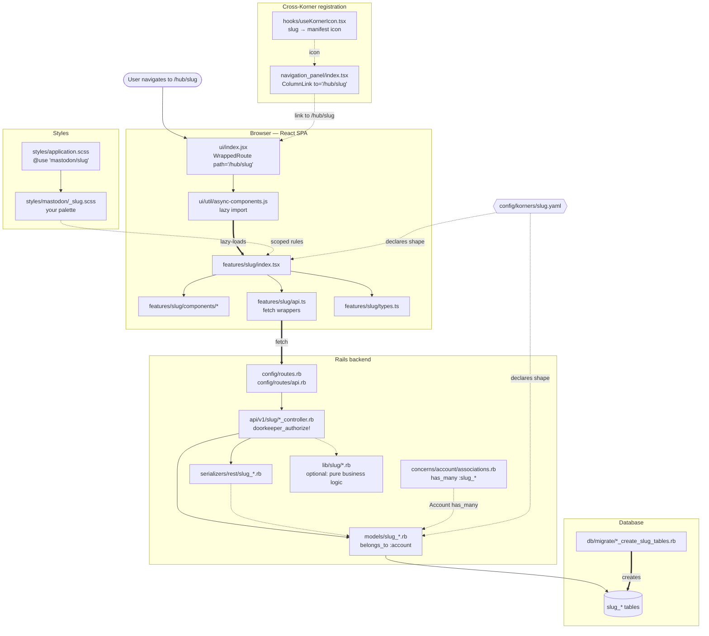
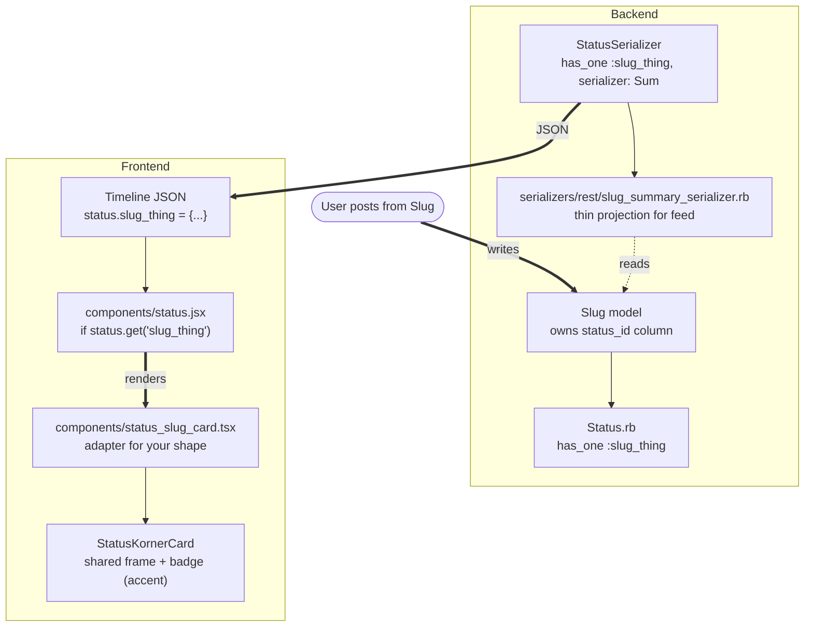

# Anatomy of a Korner

Visual companion to [adding_a_korner.md](./adding_a_korner.md) and the framework
spec [kronk_korner_spec.md](../kronk_korner_spec.md). Two diagrams to hold the
shape in your head — the **runtime map**, and **feed projection** (the layer
only some Korners need).

Per-Korner colour identity is gone: every Korner inherits the shared
`var(--accent)` (Kronk-purple) from `_tokens.scss`, and its icon comes from the
manifest via `useKornerIcon`. The retired `planets.tsx` / `--space-color` layer
is not part of this.

## The runtime map

Everything you touch to make a new Korner exist. Solid arrows are runtime
data flow; **dotted arrows are declarative** — edited once, referenced forever.
Thick arrows highlight the two moments a Korner "activates": the lazy-load into
the SPA, and the one-time table creation.

### Reading order

1. User navigates to `/hub/<slug>` (every korner mounts under the `/hub/` prefix; `AutoSpaceBadge` matches `^/hub/([a-z0-9-]+)`).
2. Rails matches the SPA wildcard route in `config/routes.rb` and returns the SPA shell.
3. The React route registered in `ui/index.jsx` mounts the async component for your Korner.
4. `async-components.js` lazy-loads `features/<slug>/index.tsx`.
5. Your feature module renders your components and calls `api.ts` for data.
6. `api.ts` hits `/api/v1/<slug>/*`, which dispatches to your API controller.
7. The controller authorises via Doorkeeper, scopes to `current_account`, hits the model.
8. The model reads/writes your `<slug>_*` tables.
9. The serializer projects the model into JSON on the way back.

### The four things not in the flow

Four boxes in the diagram aren't in the request path. They're **declarative**
— edited once, referenced forever:

- **`hooks/useKornerIcon.tsx`** — maps your slug to the Material Symbol your manifest's `icon:` declares, so the Hub tile / rail / column header all show it.
- **`navigation_panel/index.tsx`** — how a user _discovers_ your Korner without knowing the URL.
- **`concerns/account/associations.rb`** — one line so `Account.first.slug_periods` works.
- **`config/korners/slug.yaml`** — machine-readable declaration of your Korner's shape, validated at boot/CI by `bin/tootctl korners doctor`.

These are the most common source of "why isn't my Korner showing up" bugs.

---

## Feed projection

Only Korners whose data appears in the home timeline need this layer.
The registry (`components/korner_cards.tsx` → `KORNER_CARDS`) currently
holds four cards: **Kalendar, Kommons, Wachuneed, Booth**. Kuestions is
_not_ a korner card — its posts render via `post_type` +
`StatusSpaceBar`, a separate path. Klot deliberately projects nothing —
its data is private.

### Three moving pieces

- **Backend**: your model owns a `status_id`, `Status.rb` gets a matching `has_one`, and a **summary serializer** projects just the slice the timeline needs (deliberately thin, so timeline JSON stays small).
- **Timeline JSON**: the caller receives a `status` with your association populated. If it's not populated, this Korner's card doesn't fire.
- **Discriminator**: `status.jsx` picks the right card component via `pickKornerCard(status)` from the registry. Registering your card (with a `matches` predicate) also drives the body-suppression guard in `status.jsx` — the raw text body is gated behind `!hasKornerCard(status)`, so a registered card automatically suppresses it.

### Where the drift lives

**The discriminator is now a slug-keyed registry, not a branch chain.**
`status.jsx` imports `pickKornerCard` / `hasKornerCard` from
`components/korner_cards.tsx`; adding a feed-projected Korner means adding an
entry to `KORNER_CARDS` rather than editing a `status.jsx` `if` ladder. The
remaining drift is one step further out: the registry is keyed by slug in TS,
not yet read from each manifest's `feed_projection.card` — closing that
manifest-to-registry gap is the outstanding move.

---

## Layers, at a glance

| Layer                            | Files                                                                                                   | Role                                                                                   |
| -------------------------------- | ------------------------------------------------------------------------------------------------------- | -------------------------------------------------------------------------------------- |
| **Data**                         | `db/migrate/*`, `app/models/<slug>_*.rb`                                                                | Tables, all `<slug>_` prefixed. Own only what's yours.                                 |
| **API**                          | `app/controllers/api/v1/<slug>/*.rb`, `app/serializers/rest/<slug>_*.rb`                                | JSON boundary; thin controllers, authorise via Doorkeeper.                             |
| **Routes**                       | `config/routes.rb`, `config/routes/api.rb`                                                              | SPA wildcard + `namespace :<slug>` for the API.                                        |
| **Feature module**               | `app/javascript/mastodon/features/<slug>/*`                                                             | The UI. `index.tsx` mounts, `api.ts` fetches, `components/` renders, `types.ts` types. |
| **Registration**                 | `ui/index.jsx`, `async-components.js`, `navigation_panel/*`, `hooks/useKornerIcon.tsx`                  | Cross-cutting existing-file edits that make your Korner known.                         |
| **Styles**                       | `_<slug>.scss`, `application.scss`                                                                      | One partial, one `@use` line.                                                          |
| **Feed projection** _(optional)_ | `Status.rb`, `StatusSerializer`, `<slug>_summary_serializer.rb`, `status_<slug>_card.tsx`, `status.jsx` | Only if posts from this Korner render as cards in the home timeline.                   |
| **Manifest**                     | `config/korners/<slug>.yaml`                                                                            | Declaration of your Korner's shape, validated at boot/CI by `korners doctor`.          |

Everything above is _the pattern as of today_. The spec's endpoint is a
Korner that ships in half these touchpoints because manifest-driven
registration collapses many into one file. That consolidation is ongoing.
For now: match the pattern, mark the drift.
