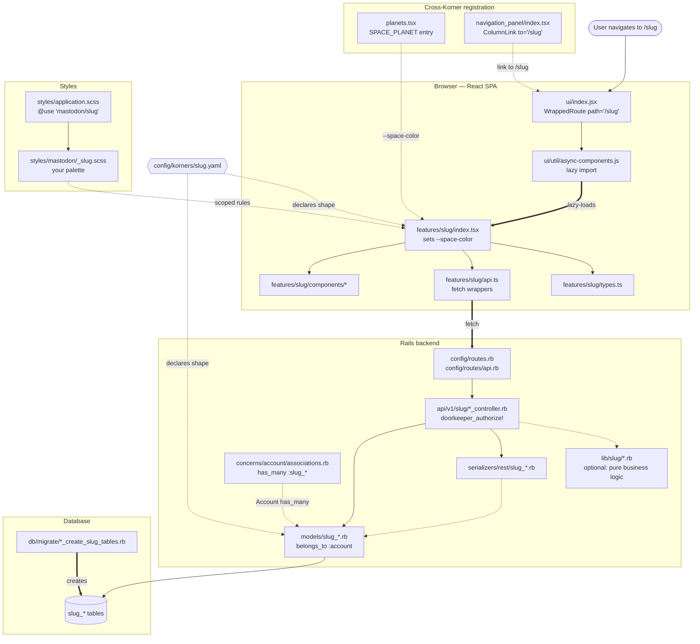
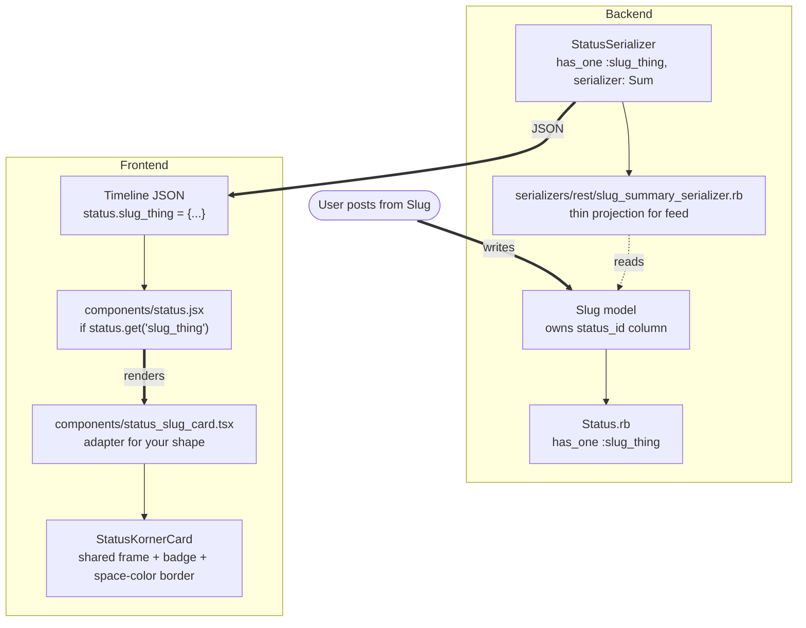

# Anatomy of a Korner

Visual companion to [adding_a_korner.md](./adding_a_korner.md).
Two diagrams to hold the shape in your head — the **runtime map**, and
**feed projection** (the layer only some Korners need).

## The runtime map

Everything you touch to make a new Korner exist. Solid arrows are runtime
data flow; **dotted arrows are declarative** — `planets.tsx` doesn't call
your code, it just exposes a colour your module reads via
`spaceColor(...)`. Thick arrows highlight the two moments a Korner
"activates": the lazy-load into the SPA, and the one-time table creation.

### Reading order

1. User navigates to `/<slug>`.
2. Rails matches the SPA wildcard route in `config/routes.rb` and returns the SPA shell.
3. The React route registered in `ui/index.jsx` mounts the async component for your Korner.
4. `async-components.js` lazy-loads `features/<slug>/index.tsx`.
5. Your feature module sets `--space-color`, renders your components, and calls `api.ts` for data.
6. `api.ts` hits `/api/v1/<slug>/*`, which dispatches to your API controller.
7. The controller authorises via Doorkeeper, scopes to `current_account`, hits the model.
8. The model reads/writes your `<slug>_*` tables.
9. The serializer projects the model into JSON on the way back.

### The four things not in the flow

Four boxes in the diagram aren't in the request path. They're **declarative**
— edited once, referenced forever:

- **`planets.tsx`** — makes your Korner's space colour derivable everywhere via `spaceColor('SlugName')`.
- **`navigation_panel/index.tsx`** — how a user *discovers* your Korner without knowing the URL.
- **`concerns/account/associations.rb`** — one line so `Account.first.slug_periods` works.
- **`config/korners/slug.yaml`** — machine-readable declaration of your Korner's shape. Not enforced yet; will be Phase 3.

These are the most common source of "why isn't my Korner showing up" bugs.

---

## Feed projection

Only Korners whose data appears in the home timeline need this layer.
Currently: **Kommons, Kuestions, Marketplace**, and **Booth once its
`shared_status_id` backend lands**. Klot deliberately does not — its data
is private.

### Three moving pieces

- **Backend**: your model owns a `status_id`, `Status.rb` gets a matching `has_one`, and a **summary serializer** projects just the slice the timeline needs (deliberately thin, so timeline JSON stays small).
- **Timeline JSON**: the caller receives a `status` with your association populated. If it's not populated, this Korner's card doesn't fire.
- **Discriminator**: `status.jsx` picks the right card component based on which association is populated. Also add your association name to the suppression list at `status.jsx:692` so the raw text body doesn't render beneath your card.

### Where the drift lives

**The discriminator is currently a branch chain in `status.jsx`.** Adding a
feed-projected Korner still means editing that file. Manifest-driven
discrimination is a Phase 3 move — the manifest will declare which
association triggers which card, and `status.jsx` becomes a lookup instead
of a switch.

---

## Layers, at a glance

| Layer | Files | Role |
| --- | --- | --- |
| **Data** | `db/migrate/*`, `app/models/<slug>_*.rb` | Tables, all `<slug>_` prefixed. Own only what's yours. |
| **API** | `app/controllers/api/v1/<slug>/*.rb`, `app/serializers/rest/<slug>_*.rb` | JSON boundary; thin controllers, authorise via Doorkeeper. |
| **Routes** | `config/routes.rb`, `config/routes/api.rb` | SPA wildcard + `namespace :<slug>` for the API. |
| **Feature module** | `app/javascript/mastodon/features/<slug>/*` | The UI. `index.tsx` mounts, `api.ts` fetches, `components/` renders, `types.ts` types. |
| **Registration** | `ui/index.jsx`, `async-components.js`, `navigation_panel/*`, `planets.tsx` | Cross-cutting existing-file edits that make your Korner known. |
| **Styles** | `_<slug>.scss`, `application.scss` | One partial, one `@use` line. |
| **Feed projection** *(optional)* | `Status.rb`, `StatusSerializer`, `<slug>_summary_serializer.rb`, `status_<slug>_card.tsx`, `status.jsx` | Only if posts from this Korner render as cards in the home timeline. |
| **Manifest** | `config/korners/<slug>.yaml` | Declaration of your Korner's shape. Not enforced yet. |

Everything above is *the pattern as of today*. The spec's endpoint is a
Korner that ships in half these touchpoints because manifest-driven
registration collapses many into one file. Getting there is Phase 3.
For now: match the pattern, mark the drift.
